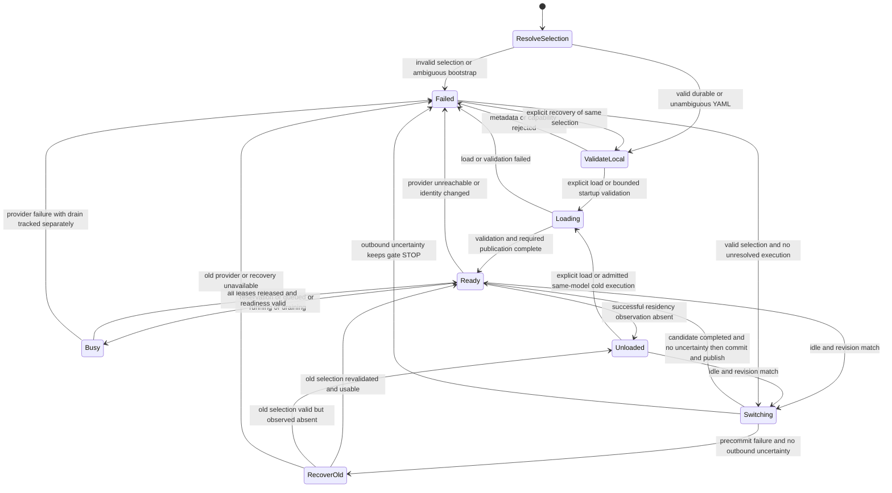

# ADR-015 — Active Model Management Foundation

Status: Accepted

Date: 2026-10-08 (Asia/Shanghai)

**Architecture Guard Final Review: APPROVED — GO。**
**Architecture blockers: 0。** Architecture Guard 已独立完成 ADR-015 最终架构复审。
**Architecture approval does not authorize implementation。** 本轮仅授权正式批准文档与 docs-only Git publication。
**Production implementation: NOT STARTED。**
**Windows/Browser acceptance: NOT PERFORMED。** Accepted 记录已批准合同，不表示产品功能已完成。

## 1. Reality Gate

本次正式批准入口：`main / HEAD / fresh origin/main = 172343e02511fed2bdee110e56509e0894f8951b`；
按指定代理命令 fresh fetch 成功，与审查基线无远端差异。工作树只有下述四份待提交文档，无其他用户修改；
祖先、仓库及 docs 适用路径未发现额外 AGENTS.md，遵循用户提供的 AGENTS 指令。
审查基线仅用于比较，未 reset 或覆盖工作树；本轮不重新审计 Browser sibling。

以下两仓库审计表是此前候选形成时的历史证据，不是本轮重新执行的两仓库 Reality Audit。
候选形成时实际执行只读源码核对和两仓库 fresh fetch；fetch 使用用户指定的单次命令级
`http.proxy` / `https.proxy` = `http://127.0.0.1:7890`，均成功，无 fallback、全局配置或系统代理变更。

| 仓库 | 实际 branch | HEAD 与 fresh origin/main | 初始工作树 |
| --- | --- | --- | --- |
| `qianlixunbai/personal-ai-workspace` | `main` | `172343e02511fed2bdee110e56509e0894f8951b` | clean；与用户参照基线完全一致 |
| `qianlixunbai/local-ai-assistant` | `main` | `5c5b239468175b679c06a48966f21255ac87279e` | clean；独立 fetch、独立源码核对 |

主仓库在 `D:/IDEA/Daima/personal-ai-workspace`，Browser 在 sibling `D:/IDEA/Daima/local-ai-assistant`。
核对 `D:/`、`D:/IDEA/`、`D:/IDEA/Daima/` 的祖先 AGENTS.md 与两仓库文件清单，未发现额外文件指令；
适用本次用户提供的 AGENTS 指令：保守、最小 diff、最小测试、禁止未经授权的发布与历史改写。
未 reset、覆盖用户改动、改写历史、创建分支、调用 Ollama、修改 sibling/Finance。

以下为上一轮 Targeted Remediation 记录，保留其形成时证据：主仓库 `main / HEAD = 172343e02511fed2bdee110e56509e0894f8951b`：
`STATUS.md`、`V1-ROADMAP.md`、`current-architecture.md` 已有未提交修改，ADR-015 为 untracked 候选。
保护上述输入，仅在其上修订；没有 fresh fetch、复审 sibling 或重跑旧审计。本轮只读核对
`NativeWebFetchConfirmation` / `WebFetchConfirmationWindow`、`WorkspaceWebFetch` / `WorkspaceBridge`，
以及 `OllamaProvider.exchange`、`TaskManager.Job.run`、`LocalClientToken` / `PrivateMemoryDirectory` 的 owning code。
现有 native 模式包含 frozen exact intent、60s lifetime、默认 Cancel、session invalidation、one-shot consume 与 late-response suppression；
现有 HTTP future cancellation / worker finally 不提供远端完成证据。以下契约仍是未来实现要求。

源码事实（下列路径相对所属仓库，不是本轮实现清单）：

| 现有 owner | 实际行为及本候选的切入点 |
| --- | --- |
| `src/main/resources/application.yml`；`model/ModelProfile.java` / `ProfileResolver.java` | 三个 profile 当前都配置 `ollama / qwen3.5:4b / LOCAL`；context 均 8192；profile 同时含模型与 capability budgets，无 Active selection |
| `provider/ProviderRegistry.java`；`policy/ProviderPolicy.java` | 已有 ProviderRegistry；现有 policy 固定本地 Ollama，无 cloud fallback；保留它们，不新增多 Provider 系统 |
| `provider/ollama/OllamaProvider.java` | loopback/no proxy/no redirects；`ensureModel` 只用 tags 名称存在性；`/api/chat` 响应拒绝 tool_calls；这尚不能证明模型是 local source |
| `capability/TextTaskSubmission.java` | 普通文本在提交前 resolve profile，worker 捕获 execution；Conversation 的 prepare 会再次 resolve，尚无 switch reservation |
| `conversation/ConversationExecution.java` | resolve/mandatory validation → durable USER Turn → prepare → TaskManager；新增 switch gate 必须前移到 durable USER Turn 之前 |
| `task/TaskManager.java` | 单 monitor；worker 在锁外执行；终态与 `inWorker` 分离，cancel/timeout 后可能继续 drain；没有模型切换 owner |
| `capability/knowledge/KnowledgeAnswerService.java` | 多次 fitsInput 后 submitMapped；未来必须共享一个 frozen profile；K2 evidence/store lock 与推理分离保持 |
| `capability/translate/TranslateReadiness.java` / `TranslateService.java`；`api/TranslateController.java` | 已认证精确 Translate readiness GET，只返回 available/受控 error，无 cache identity |
| `security/BrowserClients.java`；`LocalClientToken.java`；`memory/PrivateMemoryDirectory.java` | 现有 private/atomic/single-writer 做法可参考；不得为本任务重构这些 owner 或修改其持久格式 |
| Desktop `Bridge/WorkspaceStatusProbe.cs` / `WorkspaceBridge.cs`；Core `RuntimeClient.cs`；Frontend `SettingsPage.tsx` | trusted bridge/session/RuntimeClient；现有 Settings 区分 Runtime health 与模型能力，但没有模型管理 |
| Browser `browser-extension/content.js` | cache key 为 text/targetLanguage/profileId/profileVersion/promptVersion；`prepareCachedBatch` 先查 cache 再 checkCacheAccess；selection 同样先取旧值；全命中时没有新 task identity |
| Browser `browser-extension/runtime-client.js` / `runtime-router.js` | CHECK_CONNECTION 转发 readiness；client 只消费 available，task identity 来自 profile/prompt；已有 Single/Batch 分离与 generation suppression |

Java 表格中的短路径均在 `src/main/java/io/github/qianlixunbai/workspace/` 下。
W1B 候选研究完成是本次用户确认的阶段输入；此基线文档仍写 backend 未选定/下一活动 review，
本轮不据此猜测已批准 backend，不追改 ADR-014 或研究历史。

## 2. Approved Architecture Summary

正式顺序：**暂停 W1 后续联网开发 → Model Management Foundation → V1 Multimodal / Vision Foundation
→ Personal Finance OS 独立收尾 → F0 Finance Reality Sync**。Model Management 为跨阶段平台任务，不新增顶层 milestone。
W1A 保持 CLOSED — GO；W1B 候选研究完成但 Search implementation NOT STARTED；W1C/W1D 未开始；W1 Overall PAUSED / NOT CLOSED。
Finance Integration 在 F0 前保持冻结，Finance 独立收尾不授权 Workspace 集成，也不在本轮访问 Finance 仓库。

Runtime 只引入一个 Active Model owner、小型 selection store 和现有任务入口的统一 reservation。
保留 capability/provider/domain 架构；Settings 通过 typed native bridge 展示与显式操作。
Browser 必须先具备 freshness-aware cache contract，再开放 Runtime 切换；无模型市场、下载、Agent、通用进程管理或资源监控。
新增模型相关协议、HTTP conflict、公开有效 version 语义及 native bridge 必须在实施审查中显式呈现，不能默默改变。

## 3. 完整已批准决策

### A. ONE Active Model / authority

Runtime 是 Active Model 的唯一权威。正常可执行状态恰好一个 Active snapshot；故障/尚未验证状态可以没有可执行 snapshot，
不能为凑齐 ONE 选择另一个模型。Configured selection 可以在 unavailable 时继续存在。
所有文本路径（Ask、Summarize、Translate Single/Batch、explicit Memory Ask、Conversation、Knowledge Answer）共用它。

Capability profiles 继续拥有 prompt/capability、context/output budget、temperature、input/output validation、LOCAL_ONLY policy。
模型 metadata/catalog 是 Runtime lifecycle owner 的信息，不把 installed/loading/vision 状态塞入 capability profile。
现有 `ModelProfile` 可先作为兼容配置/immutable execution record；由 Runtime 将 selected identity 与 profile 的既有参数绑定，
禁止 worker 再查当前 selection，禁止客户端提交任意 provider URL/model override。ProviderRegistry 和 Provider execution 边界保留。
不创建多 Provider Registry、模型市场、Agent、自动下载器或新的 model tool calling。

### B. 向后兼容 bootstrap

仅当 selection 正常确认不存在，且无未提交 selection artifact/读取错误时，使用当前合法有效 YAML 配置中的既有模型。
§5.3 execution guard 独立优先关闭 AI/load gate；legacy bootstrap 不能绕过它。
读取的是实际 Spring 配置绑定结果（包括合法用户 override），不能硬编码本仓库默认模型或选择 tags 第一项。
三个既有 profile 的 provider/locality/model 必须可归一为同一 Ollama 本地身份；如果 override 指向不同模型，
ONE Active Model 与旧多模型配置冲突，模型子系统受控失败，提示用户明确统一配置或显式选择，不能静默选一个。
Bootstrap 仍须 local admission 与 text validation；不通过则 configured 存在、AI unavailable，无 fallback。

首次兼容启动不写 selection、不改 YAML；缺省 durable revision 为 0，仅作为“尚未持久化”的 CAS 值。
用户完成一次成功的显式选择（包括明确选择同一模型）后，才创建 revision 1 的 durable selection。
此后 selection 对模型选择优先，YAML 继续提供 capability 配置；不能从 YAML 改动自动迁移/覆盖 selection。
malformed/未知 version/权限失败/未知 source/digest 改变均 fail closed，不能当成文件不存在。
基础 YAML 本身非法导致现有 Runtime 启动失败时，不声称领域 API 仍可使用，不引入全局配置修复框架。

### C. Local-only admission

在 Active 之前取得一致 installed identity + manifest digest + completion capability + context compatibility
+ 正面 local-source metadata + 无 unsupported remote/cloud indicators；缺一项拒绝。
详见 §6：tags/loopback/name 仅是部分事实，不能独立证明 LOCAL_ONLY。
Runtime 的 local-only 结论是对支持的可信外部 Ollama metadata 的策略验证，不是外部进程的网络隔离证明。
只说明官方 local-only 配置操作，不改用户 Ollama 环境变量、配置、登录或进程。

### D. Switching / task gate

只有一个 Runtime switch owner，AI reservation 与 switch begin 在同一短临界区线性化。
切换中新的 AI admission 返回受控 HTTP 409 conflict；不等待、不重试、不暂存正文、不保存新的 Conversation USER Turn。
reservation、queued、running、cancelled/timed-out-but-draining、external execution uncertainty 均阻止 switch begin；terminal retained result 本身不阻止。
任务从 admission 起使用 immutable model/profile/prompt snapshot；Conversation mandatory/context validation、prepare、queue、worker 共用它。
详见 §5；任何 TaskManager/DB/Knowledge 锁内不得网络加载、metadata 请求、健康检查或推理。

### E. Resource / residency

ONE Active Model 约束 Workspace 的路由，不约束整个外部 Ollama 的驻留模型数量。
不自动 unload 未知模型，也不能因为曾由 Workspace 使用就推定无人共享。
必须区分 Workspace **explicit unload**（明确发送单模型释放请求）与 Ollama **automatic eviction**（外部 scheduler 自行驱逐）。
[Ollama v0.40.0 scheduler](https://github.com/ollama/ollama/blob/v0.40.0/server/sched.go) 在 runner 数量/内存不足时可驱逐驻留模型，
OOM recovery 路径也可能驱逐多个模型；这是该固定版本的源码事实，不是 Runtime 的控制能力或 supported-version admission 批准。
“未发送 explicit unload”不保证旧 Active 或其他客户端的模型持续驻留，candidate warm/probe 也可能触发上述影响。
所有跨模型切换在任何 candidate load/warm/probe 前都必须取得 §5.4 的 WPF native exact-intent 确认，
默认路径仅不发送 explicit unload，仍提示 automatic eviction 及其他客户端后续请求需重载、延迟或失败的风险。
用户可另外明确选择“释放旧模型后切换”；其确认须额外授权准确旧 identity/digest 的一次 explicit Release。
standalone Release 也仅单模型、单次授权；不授权 kill 进程、停止其他执行、批量卸载或自动清除其他模型。
Release 前须无 Workspace lease/uncertainty，并由用户确认已与共享客户端协调；外部空闲只是用户接受的信任假设。
无法取得该确认则拒绝 Release；`/api/ps`（包括空列表）仅是 residency 观测，不能证明外部客户端空闲。
低显存路径为 native exact-intent → idle gate / local admission → authorized single release → load/validate → persist/publish。
失败保持旧选择；旧选择若需重载，该动作同样可能驱逐候选/其他驻留模型，必须重新 native 确认后才进行有界恢复加载。
只读重验旧 metadata/residency 无需加载确认；未确认或有 uncertainty 时不得自动重载，不循环重试。
旧 configured/durable selection 与实际 resident state 分开；切换失败不承诺旧模型仍驻留或可立即使用。
候选加载失败后也不自动 unload 可能已被共享的候选；外部服务可能残留多个模型，界面须如实表达。

### F. Persistence

Runtime-owned private `active-model.json` 放在 Runtime 固定配置解析出的专用 model-state 子目录，独立于领域数据与备份。
生产根目录仅由 Runtime 启动配置确定；React/Browser、catalog 和 HTTP mutation 不能传路径或改变根目录。
测试/验收必须在 Runtime 启动前显式指定新建、独立、owner-only 的临时状态根目录；未配置隔离根不得运行模型状态验收。
测试 token 使用该临时根下独立 credentials 子目录，model-state 为其 sibling；领域 fixtures 在独立 data 目录，
沿用现有凭据/领域目录分离要求，不将领域数据放入 credentials。测试不得读取、复制、覆盖真实 token 或用户 Active selection，
不得 fallback 到生产状态根。生产 token 的既有配置/轮换方式不因 selection store 新增而改变。
一个稳定 `.lock` 文件由 Runtime 生命周期持有独占 OS file lock；
第二 writer 不得写 selection，不得绕过锁；其模型管理不可用，正常 Runtime port/single-instance 边界继续适用。

v1 exact schema 候选示例（占位值不是当前选择或本轮生成的配置）：

```json
{
  "version": 1,
  "selectionRevision": 1,
  "provider": "ollama",
  "model": "example-local:tag",
  "digest": "0123456789abcdef0123456789abcdef0123456789abcdef0123456789abcdef"
}
```

exact fields；拒绝未知/重复 key、尾随 token、null、错误类型、浮点/越界 revision、未知 schema/provider。
文件至多 4096 UTF-8 bytes（读取也必须 bounded，不能先 readAllBytes 再测大小），strict UTF-8，不接受 BOM/invalid encoding。
revision 为 1..9007199254740991 的整数（兼容 JS 安全整数），0 不写盘；耗尽 fail closed。
model 是 1..256 UTF-8 bytes 的规范 installed local reference，禁控制字符/任意 URL；以 §6 的解析规则和 exact installed match 为准。
digest 固定规范 lower-case 64 hex 的 manifest SHA-256，支持的 API 若有 `sha256:` 前缀必须在验证后统一；不能用名称代替绑定。
digest 是身份绑定，不是数字签名或 origin authenticity proof。

目录、selection、pending、lock、§5.3 execution guard 都要求 owner-only；创建时使用私有权限，验证 Windows ACL/POSIX mode；无法保证则拒绝模型管理。
对祖先、目标、pending、lock 做 NOFOLLOW regular/type/owner 检查，拒绝 symlink、junction/reparse 与不明特殊文件；
发布前重验路径身份，不跟随 metadata 返回路径。路径检查不承诺抵御管理员或恶意同 OS 账户 TOCTOU。
新 JSON 写同目录 CREATE_NEW 私有临时文件，bounded serialize → flush/force → 重验 expected revision/旧文件身份
→ ATOMIC_MOVE replace；不支持 atomic replacement 则失败，不退回 truncate 或 delete-then-move。
只有提交成功后才发布内存 Active snapshot 与新 cache epoch；loaded/ready/busy/GPU 不持久化。

switch owner 从 begin 到 publication 始终独占，不需要持 gate monitor 做 IO；持久化期间新 admission 仍被逻辑 gate 拒绝。
外部文件被改动/删除不当成合法 writer，停 AI 管理并提示恢复；revision CAS 不是同账户恶意写入防御。
pending 永远不自动晋升；无 valid committed 文件而有 pending 时禁止 legacy fallback，须显式恢复。
已有 valid committed 文件时只承认该文件，孤立 pending 可在验证为 owner 生成的普通私有 artifact 后处理，不能选择 pending 中模型。

token 随 credentials 生命周期保留/轮换，不随切换或 Release 删除；selection 跨 Runtime restart 保留。
OS lock 仅在 writer 运行期间持有；lock 文件保持稳定，不能 delete/recreate 绕过第二 writer。
selection pending 只属于一次原子提交，失败时仅清理已验证属于本次操作的 artifact；crash leftovers 按上述规则处理。
execution guard 的跨 restart 生命周期见 §5.3，不与 selection pending 混淆，也不因 task retention 到期清除。
验收结束先停止隔离 Runtime/释放 lock，再确认清理目标严格位于本次显式临时根内；
失败现场可私有保留，不删除真实凭据/选择/领域目录。只增加窄 model-state 启动配置，不创建通用 Workspace Settings Framework。

rename 前失败保持旧 durable selection；rename 已提交而进程崩溃/HTTP 响应丢失属于“提交结果未知”，不能报告回滚成功。
Runtime 读回确认确切新 revision/digest 后可恢复 publication；无法判定则 gate fail closed，重启严格读取 committed 文件。
断电 durability 取决于 Windows/filesystem 的 flush/rename 保证，不声称跨所有文件系统绝对 crash-proof；验收验证目标 Windows 文件系统。
不新增 Memory/Conversation/Knowledge schema、migration、backup fields 或 selection backup 隐式恢复。

### G. Browser cache consistency

Browser 继续 Translate-only。在现有认证 readiness 上增加 versioned、bounded、non-sensitive 有效 cache identity，
同一 admission snapshot 的 TaskView 必须携带一致有效 profile version；详情与最小跨仓库顺序见 §7。
Browser 不得得到 catalog、真实模型名/digest、内部路径、GPU/selection revision 或模型管理 authority。
本轮只核对 Browser 源码；不修改 sibling 的任何文件。

### H. Status / Settings

| 事实字段 | 定义与观察来源 |
| --- | --- |
| configured | Runtime 当前有效配置意图，来源为 legacy YAML 或 valid durable selection；不表示成功安装/加载 |
| installed | 可信 tags/show 一致身份与 digest 的观测；不可达/未知时为 Unknown，不能断言 Missing |
| loaded | 新鲜受信 `/api/ps` 中匹配身份/digest 的驻留观测；成功查询无目标才可为 false；不证明正在执行 |
| active | Runtime 已验证、已公布的唯一执行身份；可同时 ready=false；失败候选从不冒充 Active |
| ready | 当前本地来源/能力/context validation 有效，服务可用、允许 admission；不是 permanent residency/质量保证 |
| executing | Runtime 知道的 worker 执行；reservation/queued/draining 单独计数；worker=0 不证明远端已停；externalExecution / uncertainty 单独报告 Unknown |

Loading/Ready/Busy/Unloaded/Failed 必须与这些正交事实、observedAt/受控 reason 组合，见 §4。
Runtime 不可达与 Ollama 不可达分别表达；Ollama 不可达是 Failed + loaded Unknown，不能显示 Unloaded。
GPU 信息仅展示服务确实返回的有界 metadata/Unknown，不实现资源采集框架，不把 CPU fallback 误报 GPU Ready。
catalog metadata 不可信：Runtime 只映射有界安全字段，不转发 raw show/Modelfile/system/path 到 UI。
React Settings 只消费 typed model rows/status、opaque catalog handle、expected revision 与显式动作；禁止直连 Ollama。
模型显示名可在 native-authorized Settings 安全展示；Browser 无权获得该显示名。
WPF 保留 trusted bridge、current-session authority、application-owned RuntimeClient；跨模型切换、Release 与 uncertainty recovery 使用窄 native exact-intent confirmation。
session/document replacement 作废 pending confirmation，抑制 late responses，不取消已提交 switch、不自动重复 POST。
switch outcome unknown 只读核对 current selection/status；不能用重新提交猜测恢复。

Runtime 在线且 domain store 健康时，模型失败不阻塞 Memory CRUD、Conversation 历史或 Knowledge lexical search。
模型 gate 只覆盖 AI admission，不覆盖领域 API/auth/backup gates；domain 自身故障仍受控失败。
Runtime 整体不可用时必须显示这些服务不可用；React 中留存的历史画面不能当成实时领域服务正常。

### I. Vision preparation

明确分开 `providerDeclaredVision`、`runtimeValidatedText`、`workspaceVisionExecutionValidated`。
show 声明 vision 只是 provider metadata；本 Foundation 的最后一项固定 false / NotValidated。
显示“Provider 声明 Vision；Workspace Vision 未验收”，不能因 qwen/模型名或 Vision 声明启用图片能力。
本轮/本 Foundation 不上传图片、不实现多模态输入/执行/存储、不引入 model tool calling。
未来 V1 Vision 经独立架构和执行验收后才有 Workspace Vision readiness。

## 4. Active Model Lifecycle State Machine

这是未来 Runtime 状态合同；现有代码尚未实现。下面用候选过程与旧 Active 分离表达，避免 Loading 候选冒充已提交模型。



Loading 表示 Runtime 有实际 bounded load/validation 操作；仅打开 Settings/查询 catalog 不应自动 warm 所有模型。
Ready 是已验证且允许请求，不承诺永远驻留；Unloaded 是健康服务成功观测到未驻留，可支持 same-selection 的冷执行。
Busy 至少包含本 Workspace 尚未释放 lease 的执行压力；executing/counts 区分真正运行与 queued/reservation。
Failed 与 draining/uncertainty 可同时存在，不能因 UI 状态 Failed/Task CANCELLED 或 worker=0 就释放 switch gate。
Switching 期间旧 configured/active 标识保持，候选单独 Loading；commit 后才变更 active/revision/cache epoch。
失败前未获得 switch owner 的请求只是 conflict，不进入 Loading，不执行 release/load/persist。
Unknown 是 loaded/installed/externalExecution 等事实字段的值，不伪造第六种 GPU 或 residency 状态。
没有 Active 时所有 AI unavailable，但在线 Runtime 的领域 API 保持独立。
所有跨模型 candidate Loading（包括候选已驻留后的 warm/text validation）都以有效 native exact-intent 为前提，见 §5.4。
确认前仅可只读 catalog/metadata；拒绝、过期或 session replacement 时 zero new candidate load、zero Release、zero selection write。
Switching/RecoverOld 不承诺旧 residency 不变；RecoverOld 的 reload 须另行确认。external uncertainty 下当前 Active 新 AI admission 也关闭，
只读状态/领域 API 保留；明确恢复满足 §5.3 / §8 后才能重验 readiness，不能从 Failed 直接跳过 uncertainty。

## 5. Switching Linearization / Concurrency Contract

### 5.1 单 owner 与 immutable reservation

一个短时 model gate monitor 保护 switch owner、当前 immutable snapshot 与 outstanding AI leases。
网络、磁盘、DB 工作在 monitor 外；reservation 是有界逻辑租约，不是一直持有 Java 锁。
租约上限复用 task active/queue capacity，不另建无限队列；validation 受已有 deadline 约束。
未出站的拒绝/异常 finally 释放；已出站的 lease 必须满足 §5.3，不能无条件 finally 释放。
跨域前置 snapshot 读取可以先完成，但对模型/profile 的任何 validation/packing 和 durable USER Turn 写入必须在获得 reservation 后。

AI admission 线性化点：在 gate 内确认无 switch owner、selection usable，然后递增 lease 并捕获 model identity/digest、
selection revision、全部 capability parameters、promptVersion、effective public version、local admission evidence。
这是 admission reservation 的承诺点；HTTP 202 仍是 TaskManager 真正接受后的响应，reservation 不冒充 accepted task。
后续用相同 snapshot 做预算/prepare/worker/final egress validation；不重新 resolve “当前 model/profile”。
egress metadata 不匹配则受控失败，不能重定向到当时新 Active。

switch begin 线性化点：同一 gate 内检查 expectedSelectionRevision、catalog handle/digest、
没有其他 switch owner、没有 outstanding leases/draining/uncertain execution，原子设置唯一 switch owner。
若 AI 先取得 reservation，switch 409；若 switch 先取得 owner，AI 409；新请求绝不进入等待切换的队列。
两个 switch 请求最多一个开始，另一个 409；stale revision 409 且 zero load/release/write。
建议明确新增 `MODEL_SWITCH_CONFLICT` 与 `MODEL_SELECTION_REVISION_CONFLICT` 受控 code，HTTP 409；
不是模型缺失、QUEUE_FULL 或笼统内部错误，Desktop/Browser 的 safe message 必须同步。

### 5.2 普通 task 与 Conversation 一致

普通任务：reservation → frozen profile validation → TaskManager submit → lease ownership 转交 Job。
提交拒绝释放 reservation；queued cancel/timeout 只有确认未开始、已移除/无法开始才释放；worker 从 QUEUED 到 RUNNING 不能留下计数空窗。
running terminal 不释放；本地 worker/provider operation 退出且 §5.3 完成事实成立才 exactly-once 释放，
否则在 finally 将 lease 转交窄 uncertainty guard，本地 worker 退出不丢失切换 STOP。
到达 terminal 的 retained TaskView 仍持原 effective identity，不因新选择被重新标记。

Conversation：reservation → mandatory input + Memory/context validation（同一 profile）→ existing USER Turn 写入
→ 用同一 snapshot prepare/TaskManager submission。切换中的请求在 reservation 阶段拒绝，**zero new USER Turn**。
reservation 之后其他 queue/storage/execution failures 继续既有 FAILED Turn/reconciliation 语义；不为此增加 DB migration。
Memory Ask/Knowledge Answer 也复用 reservation；Knowledge packing 多次 fitsInput 必须针对同一 frozen profile，
K2 immutable evidence/revision/citations 契约及 store → lexical publication 顺序保持。

### 5.3 Lock order 与 draining

禁止持 model gate 时调用 TaskManager/DB；禁止持 TaskManager/DB 时调用 model gate。
取得 lease 后释放 gate，再调用 domain/TaskManager；Job completion 保留现有 TaskManager → Conversation finalize 顺序。
TaskManager 中只决定 queued/remove/start/finish 状态，lease release 在退出其 monitor 后进行。
删除 queued job 与 worker-start race 必须由现有 task monitor 决定唯一 owner，不能双重释放或让 switch 趁空窗开始。
metadata/catalog/load/probe/persistence 都不持 TaskManager/DB 锁，也不从锁内等待 provider future。

execution lease 结束必须区分以下事实；同样适用于 candidate load/warm/probe、explicit Release 与恢复加载：

| 请求边界 / 证据 | lease 与允许动作 |
| --- | --- |
| 能证明尚未调用 inference/load/release transport send，queued job 已无法启动且本地操作已退出 | 零 inference egress；可以释放。metadata GET 已发送不等于 inference 已发送 |
| 已出站，收到与原操作匹配、符合固定版本可信完成协议的响应，且本地 worker/provider operation 已退出 | 正常结束对应 lease；即便用户 task 已 CANCELLED/TIMED_OUT，也不能复活 task、写回 late result 或 replay |
| 已调用 send 但没有可信完成证据；cancel/timeout/transport failure/无效或截断响应，哪怕 worker 已退出 | 保留 execution uncertainty；不能推断远端停止。普通 HTTP error、future cancellation、deadline 或服务暂不可达均不足以释放 |

可信完成证据与输出业务 validation 分开：例如受信原请求的完整 `done=true` 响应可证明完成，
内容不合 capability 要求仍使 task 失败；未知响应 shape/身份不符则不得借 output failure 推断完成。
现有 `exchange` 的 cancelled future 会丢失 late response；本候选不要求无限等待或后台 polling，
仅在原操作仍可收到可信完成证据时自动 drain，否则进入明确人工恢复。

uncertainty 独立于 task terminal/retention、selection commit outcome 和 local draining：
**当前 Active 的所有新 AI admission fail closed**（不重放正文、不新增 Conversation USER Turn），
**跨模型 switch、Release、warm/probe/recovery load 保持 STOP**；已经取得 lease 的任务按自己的 snapshot 收尾，
其正常完成不能解除另一请求的 uncertainty。只读 metadata/status 与健康领域 CRUD/history/lexical search 不受该 AI gate 阻塞。
native Settings 分别显示 task CANCELLED/TIMED_OUT/FAILED、本地 running/draining 数、
“远端执行状态未知；当前 AI 与切换/释放已暂停”，安全 code 候选 `MODEL_EXECUTION_UNCERTAIN`（新 admission/mutation 为 409）。
不得显示“远端已停止”或把 loaded=false 当作已 drain；Browser 只收到既有 unavailable + safe error，无真实模型/路径/操作细节。

为避免 Runtime restart 遗忘已出站风险，窄 model-state owner 在任何上述 provider mutation/推理 send **之前**，
原子写入并 force 私有 `execution-guard.json`（exact `{"version":1,"unresolved":true}`，最多 128 strict UTF-8 bytes，
拒绝未知/重复字段、尾随 token/错误类型；无 model/prompt/result/token）；
写失败则零 send。一个有界聚合 guard 覆盖全部 outstanding provider leases，不建立任务 journal/supervisor。
只在所有受其保护的操作均具备上述安全结束事实且本地已退出时移除；移除失败继续 STOP。
startup 发现 guard、其 crash pending、坏格式或读取错误均视为 unresolved，不能因进程重建丢弃。
recovery generation 是有界 opaque 内存 challenge，startup/新增 uncertainty 均更换，旧 native 确认不能清除较新的风险。
guard 的创建/清除也需 §3F 同等私有/NOFOLLOW/原子文件保证；不能让较晚 send 与较早 guard 清除产生空窗。
marker IO 在 monitor 外进行，仍由逻辑 gate/单 writer 序列化；precommit/persistence failure 不能丢弃 guard。
这是对外部 uncertainty 的最小跨 restart 安全标记，不修改 selection v1 或领域/备份格式。

明确人工恢复按 §8 执行：本地未退出时不能 reset；本地已退出但远端未知时，用户先协调其他客户端，
自行确认原服务/runner 边界已结束或取得原请求可信完成证据，再通过 WPF 单次 exact-intent 接受外部服务信任假设。
Runtime 可重新验证自身零 local lease、guard generation、selection revision/digest 与新服务 metadata，
不能独立验证用户的外部停止/完成陈述；Runtime restart、空 `/api/ps`、HTTP future cancellation 不单独构成证据。
不自动 kill/restart 外部 Ollama，不自动 replay 用户请求，不引入通用 supervisor、进程管理或 GPU telemetry。

### 5.4 Commit/publication 与未知结果

所有跨模型切换先在 native owner 捕获 frozen exact intent：候选 canonical identity/digest、旧 Active（或明确无 Active）、
expected selection revision、action（默认切换 / release-old-then-switch）与 current session；安全显示准确模型，不能确认后再读 React 选择。
WPF 提示“加载候选可能使 Ollama 自动驱逐旧 Active/其他驻留模型，影响共享客户端的重载/延迟/失败；失败仅保留旧 durable selection”。
release-old 额外明确单目标一次卸载及共享协调陈述；普通切换确认不授权 explicit Release。
复用已核对的 `NativeWebFetchConfirmation` / `WebFetchConfirmationWindow` 与 `WorkspaceWebFetch` / `WorkspaceBridge` 安全模式，
不复用 WebFetch 的业务 DTO 或建立通用 Approval Framework：60s lifetime、默认/焦点 Cancel、Escape/关闭即拒绝、
session/document replacement 作废 pending、late response 不授权新 session；同一 native owner 锁内重验有效期/authority 并一次性消费后发起精确 Runtime mutation。
Runtime 仍验证 native authority、revision/catalog/digest、idle/uncertainty gate；任一不符为 zero new load/release/write。
拒绝/过期/消费前 session replacement 不得开始 candidate load；已一次性提交的操作不因随后 session replacement 自动回滚、重新提交或授权下一次 load。
实施前须再检查上述具体 owning code；本轮只验证可复用模式，没有实现模型确认 API。

确认仅授权一次精确操作；switch owner 在锁外依次 validate installed/local/capability/context → optional explicitly approved release
→ load → bounded non-private text validation → 再验 identity/digest → selection atomic commit。
提交成功后短 gate 内 publish 新 immutable Active snapshot/revision/cache epoch，最后释放 switch owner。
新任务不能见到“新 snapshot + 旧 durable selection”，也不能在 commit/publish 间 admission。
rename 是 durable commit point；gate 中的 snapshot swap 是执行可见 publication point；两者之间 gate 关闭。
crash 在 rename 前读取旧 selection，rename 后重启读取新 selection；pending 不成为权威。
precommit failure 保留旧 durable selection，仅只读更新真实旧 readiness/residency；需 reload 时先取得新的 native exact-intent，
未 reload 不承诺 Ready；满足 §5.3 后才恢复 admission；
candidate/old 恢复有 unresolved outbound operation 时保持 gate 受控关闭，不自动等待新用户任务。
postcommit response timeout 是 outcome unknown，只允许 authenticated status/revision read，不自动 replay 或反向切换。

## 6. Local-only Security Contract

本节是基于官方接口的候选 admission policy；没有本轮真实 Ollama metadata/probe 实测结果。
实施前须确定最小 supported Ollama version/metadata shape，缺证据的版本不按宽松兼容放行。

| Gate | 必须证明的 Runtime 可观察事实 / 拒绝条件 |
| --- | --- |
| Installed identity | 支持的 `/api/version`；bounded `/api/tags` 的 exact canonical reference，唯一匹配，无模糊 alias/首项 fallback |
| Digest binding | tags 的有效 manifest digest；tags → show → tags 一致；加载/验证后及每次 egress 再验；删除、替换、同名重绑即拒绝，不自动接受新 digest |
| Completion | `/api/show` capabilities 明确含 `completion`，不是仅 embedding 或未知能力；没有 completion 不发 load/probe |
| Context | supported architecture 的明确 positive context limit ≥ 全部启用文本 profile 的 contextBudget；不能降低既有预算来迁就候选；未知字段/冲突值拒绝 |
| Positive local source | 支持 shape 的本地模型格式（首期 GGUF）、一致的 architecture/model_info、非零本地 artifact size、show 生成的本地 blob FROM 引用及合法 blob digest；只解析已审核本地形式，不读取返回的路径 |
| Remote/cloud denial | tags/show/响应中非空 `remote_host`/`remote_model`、cloud/remote routing、远端 FROM/URL、未知 source/runner/manifest 形式一律拒绝；名称 `:cloud` 只作为附加拒绝信号，不能作为唯一检测 |
| Text validated | 元数据通过后执行有界非私人 text probe，使用受控 profile 与既有 provider parser/validation；不是自动运行用户 prompt，也不证明所有文本质量或 Vision |

复杂 multi-manifest/runner/adapter source 若不能在支持版本中明确证明所选本地 artifact，首期拒绝，不能选择“看起来最本地”的 child。
不要求网络下载来源必须离线：已安装的本地权重可来自先前用户下载；此处验证当前执行 source，不宣称训练/供应链可信。
source metadata 不是签名，本地 blob 引用不是 Workspace 对外部文件/权重字节的独立验证。
本地 URI allowlist/no proxy/no redirect 与 LOCAL_ONLY 仍在 admission、worker、final egress 保留。
任何 response remote/cloud indicators 拒绝整项；事后拒绝不能撤回可能已发送到恶意服务的数据，因此正面 admission 是前置必需边界。
fresh checks 降低 tag drift 风险，Ollama 按名执行的 API 不能提供跨客户端 rename/update 的原子 digest-pinned invocation。
外部其他客户端在最后一次检查后更换模型、恶意 loopback relay、伪造 metadata/进程被替换均超出 Runtime 可证明范围。
要求用户信任所连接的本地 Ollama 并避免并发改写该 identity；不能把这一假设称为 Runtime 已实现的安全隔离。

官方 FAQ 支持 `OLLAMA_NO_CLOUD=1` 或在 `~/.ollama/server.json` 设置 `disable_ollama_cloud: true`，并重启生效。
Workspace 可在 native Settings 提供该说明；本 Foundation 不修改该文件/变量、不重启服务、不读取任意服务日志，
也不从自身环境变量推断已运行外部服务生效。此设置是纵深防御，不代替 metadata admission 或 OS 级网络隔离。
没有可靠外部生效证据时显示“外部 local-only 配置未验证”，不能伪造 verified。
上述配置与驻留/keep_alive 依据 [Ollama 官方 FAQ](https://docs.ollama.com/faq)。

installed/digest 和 residency 接口分别依据 [官方 tags](https://docs.ollama.com/api/tags)
及 [官方 ps](https://docs.ollama.com/api/ps)。remote/model_info/capabilities 字段依据
[Ollama 官方 API types](https://github.com/ollama/ollama/blob/main/api/types.go)；官方 main 为可变参考，
实施时必须固定 supported release 和 fixture，不能认为所有旧版本均含这些字段。
这些来源只描述服务接口；上述 admission、拒绝策略与 trust assumptions 是本 ADR 的设计决策。

## 7. Browser Cache Consistency Contract

### 7.1 最小协议与隐私

只扩展当前认证 Translate readiness，GET path/security/credential/Origin/Fetch Metadata/task ownership 不变。
候选新版 Browser 在该精确 path 使用 `?cacheIdentityVersion=1`；query 只选择返回协议，不增加 authority。
新版 Runtime 对该 query strict validate（仅已知值，拒绝重复/未知 version），readiness `Cache-Control: no-store` 保持。

available=true 时的有界 shape：

```json
{
  "available": true,
  "cacheIdentity": {
    "version": 1,
    "single": {
      "profile": { "id": "translate.fast", "version": "am1-opaque-epoch", "locality": "LOCAL" },
      "promptVersion": "translate-v1"
    },
    "batch": {
      "profile": { "id": "translate.fast", "version": "am1-opaque-epoch", "locality": "LOCAL" },
      "promptVersion": "translate-batch-v1"
    }
  }
}
```

每个 token 仅 `[A-Za-z0-9._-]{1,64}`；exact shape/两种 mode 固定，响应上限 1024 bytes。
epoch 为 Runtime 随机 opaque token：每次进程启动、成功 Active publication 或执行配置变化重新产生，A→B→A 也不能复用。
它不编码模型名/digest/path/durable revision，也不是这些低熵信息的裸 hash；不持久化、不成为认证材料。
暂不可用/切换中不提供可用于 cache hit 的 identity，沿用 available=false + safe error；不得暴露内部失败详情。
TaskView 的现有 `profile.version` 明确改为该 execution snapshot 的有效 opaque version，保持 id/locality/prompt shape；
profile 配置原 version 留在 Runtime 内部参与 snapshot。此语义变化必须作为正式 API amendment 审查，不伪装成无行为改动。
Translate public task identity 不加真实模型字段；submit/get 从 QUEUED 到 terminal 必须恒定，旧任务不“升级” epoch。

readiness 在锁外完成 metadata check 后回到短 gate，确认 Active epoch 未变/无 switch，才线性化 available + 两种 identity；
并发 switch 则返回受控 unavailable，不能混用新 available 与旧 identity。不做 inference 或创建 task/reservation。

### 7.2 所有 cache 路径的顺序

新版 runtime-client 严格解析 identity，runtime-router 的 CHECK_CONNECTION 只传安全 shape。
content.js 的 page/viewport/dynamic/selection 均执行：authenticated readiness → validate/learn current identities
→ 变化则清除两种 cache/旧 cache plan → 按新 identity 建 key → lookup/dedupe → generation 校验 → render。
selection 不能先保存旧 cached string 再只验 available；batch 不能先生成 hits 再只验 available。
invalid/missing identity、offline/revoke/unavailable 时不得 cache reuse。
新版 Browser + 旧 Runtime：可以使用现有 translate task 协议，但缺少 readiness identity 时 cache bypass；不从旧 task identity猜测 freshness。

mixed hit/miss：task snapshot 的 effective identity 必须与 readiness/cache plan 对应；不同则丢弃旧 cached hits，
保持新 task 的真实 identity，受控报告需要用户再试，不自动重发 miss、重译 hits 或把旧译文标成新模型。
task polling identity 变化整项拒绝；cache write/render 前沿用已有 session/generation 检查，Restore/replacement 抑制 late results。
不同 mode 的 prompt version 独立，模型/profile epoch 变化同时 invalidates Single/Batch。

cache reuse 的线性化点为本次 readiness 的最终 gate check；它只保证“该时刻的有效 identity”。
如果 switch 在 readiness 后才开始/完成，已批准的一次 cache reuse 仍属于此前 snapshot，不能声称为新模型输出。
下一次 reuse 必须重新 readiness；不承诺异步 DOM 永远反映此刻 Active，不引入 WebSocket/push/infinite polling。
已展示的历史译文不自动重译，不能用于新 identity 的 cache；用户显式 Restore/再次 Translate 可刷新。

### 7.3 旧客户端与跨仓库实施顺序

仅 TaskView epoch 变化不能解决旧 Browser 的全缓存命中，因为其 readiness 不消费 identity。
新 Runtime 启用本 Foundation 时，对未 opt-in identity v1 的 Browser readiness 返回 controlled available=false，
显示需要升级/translation 暂不可用；native readiness 可保持独立兼容语义。不能继续向旧 Browser 返回 available=true 而开放切换。
已配对 credential 不变；不扩 Browser scopes/route allowlist；旧客户端可能仍能执行 miss task，但旧缓存读取必被 readiness 拦截。

最小顺序（都在独立获批之后；本轮执行 NONE）：

1. 固定 readiness + effective-version 契约与 Runtime fixture，不开放切换。
2. sibling Browser 仅改 runtime-client.js/runtime-router.js/content.js 的 identity/readiness/cache 顺序；先发布可与旧 Runtime cache-bypass 共存的版本，做 focused cache/revoke/generation 检查。
3. Workspace Runtime 实现统一 gate、durable selection、readiness identity 和 legacy Browser guard，再通过 Settings 暴露显式切换；不留“可切换但旧缓存可用”的发布窗口。
4. 一条 real Chrome + Windows flow 验证 A-cache → native switch B → 全命中旧文本不复用；包含 Single/Batch/mixed、revoke 与旧客户端受控拒绝。

Browser 修复是此 Foundation 的跨仓库交付依赖；不能在只完成 Workspace 后宣布模型切换的 Browser compatibility gate PASS。
不改 Browser 布局、B11/B12 deferred 行为、pairing storage、其他语言或权限。

## 8. Legacy Bootstrap / Configuration Recovery

| 情况 | 有效选择与允许动作 |
| --- | --- |
| selection 确认缺失且无 pending；合法 YAML 同一模型 | legacy effective selection / revision 0；验证后可使用，zero YAML/selection write |
| YAML models 不同、非法 local policy 或 unknown source | 拒绝 AI；明确配置冲突；不自动统一、降低预算或选 tags 首项 |
| valid selection v1 | 按其 model/digest；YAML budgets/prompt 等保持；服务断线/缺失不更换选择 |
| selection 坏 JSON/unknown version/oversize/权限或 link 错误 | model subsystem fail closed；不 bootstrap/fallback，不 overwrite/drop 文件 |
| same name different digest / installed removed | AI unavailable；提示显式重新验证/选择；旧 durable bytes 保留，不自动重绑 |
| candidate load/probe/precommit persistence failure | 旧 durable selection 保留；只读重验真实 residency；reload 需另行 native 确认且无 uncertainty，不保证 old Ready |
| rename committed / response lost / crash | outcome unknown；只读核对 revision，重启读 committed 文件；不自动 replay/restore old |
| no selection + pending | ambiguous first publication；fail closed；不 promote pending，不 YAML fallback |
| execution guard / unresolved outbound operation（包括 Runtime restart） | selection 按原文件读取，但 AI/load/switch/Release STOP；先走下述人工恢复，不自动 warm 或用 bootstrap 绕过 |

损坏 selection 不使整个 Runtime 因新 owner 的构造异常退出；当既有 auth/domain config 健康时，
模型管理报告 typed Failed，纯领域功能继续在线。不能截获/隐藏现有 auth 或数据库启动错误来伪造 healthy Runtime。

首期恢复采用最小 offline native/operator 流程，不增加通用 repair API：用户停止 Workspace Runtime writer，
保留坏文件作为 owner-only 隔离证据（unknown version 留给未来兼容 Runtime），任何 execution guard 也必须保留，
明确选择恢复已知 valid v1 selection 或移出坏文件以重新启用合法 YAML bootstrap。
重新启动后仍执行全部严格 schema/source/digest validation；恢复备份不等于 Ready。
修复 selection 不解除 uncertainty；重启后 guard 仍优先关闭 load/AI gate，再按 §8.1 恢复，避免坏 selection 与 uncertainty 相互绕过。
这些操作必须明确提示“将重新采用 YAML/指定 selection”，本轮不执行任何隔离、删除或配置恢复。
普通 POST switch 不能把坏文件当 revision 0 覆盖；不同 schema 的自动迁移不在本 Foundation 范围。

### 8.1 External execution uncertainty — 可操作的人工恢复

1. 用户在 native Settings 查看“远端状态未知 / AI 与切换暂停”，只读核对当前 durable revision/模型、
   local running/draining 与 uncertainty；取消/超时的原 task 保持原终态，恢复不再次发送它。
2. local worker/provider operation 尚未退出则维持 STOP，不能通过确认强行清 lease。
   若本地 drain 无法结束，用户可通过已有 Workspace 退出/Runtime 停止方式结束本地 writer，再重启；
   私有 execution guard 保留，重启仅重新提供状态/恢复入口，不执行 load/probe，不声称远端完成。
3. 若原操作仍收到可信完成响应，且对应本地 operation 已退出，可按 §5.3 正常 drain；
   若响应已丢失，则用户暂停其他客户端的新请求，并与其使用者协调，不能以等待固定秒数、空 `/api/ps` 或连接失败替代核对。
4. 远端完成无法取得时，用户自行通过其原 Ollama 启动方式结束原服务及 runner：例如 Windows 托盘 Quit / 原终端退出，
   服务部署使用其既有服务控制方式；在 Task Manager/原启动器核对原服务与 runner 已结束，然后手动启动可信本地 Ollama。
   如不能确认原服务/runner 边界或无法协调共享客户端，保持 STOP，不提供绕过按钮；Workspace 不代执行任何停止、kill、restart 或安装操作。
5. 回到 native Settings 点击窄“核对外部恢复”只读刷新；Runtime 重验本地零执行/零 reservation、
   当前 guard generation（含 restart 后的新恢复 challenge）、selection revision/digest、configured endpoint 与 bounded version/tags/show。
   `/api/ps` 只更新 loaded，不能清 guard；元数据健康不证明历史远端请求完成。跨模型候选与坏 selection 恢复仍需各自 gate。
6. WPF 展示准确当前选择与本次 uncertainty recovery，默认 Cancel、60s、session/late-response/one-shot 模式同 §5.4。
   用户明确确认：“已协调共享客户端，确认原请求完成或原服务/runner 已结束；接受 Workspace 无法独立证明该外部事实”。
   恢复授权绑定这次 guard generation、revision 和 session；拒绝、过期、replacement 或新 lease/generation 不符均不清除 guard。
   这只是用户接受的外部服务信任假设，UI 与记录不标记为 Runtime 验证了远端 drain。
7. 唯一 model-state owner 在 gate 保持关闭时重验无本地执行，可靠清除该 guard（失败仍 STOP），
   再对原 configured selection 做只读 local-source/digest/capability/context revalidation；没有自动 candidate load、自动 reload、Release 或用户请求 replay。
   原 Active 的 runtimeValidatedText 证据仍有效且服务健康、仅未驻留时显示 Unloaded，允许之后由用户发起原 Active 请求。
   restart 后缺少当前 text-validation 证据时仅为 configured / NotValidated，AI 仍不可用；用户须另行 native 确认原选择的有界 load/text validation，不能因清 guard 就跳过 activation validation。
   selection 坏、模型缺失/source 或 digest 改变仍 Failed，不能因 uncertainty reset 选 tags 第一项或写新 selection。

只允许小型 native-only status/recovery 动作及 guard，非通用 repair/supervisor API。
Runtime 可证的是 local lease 已结束、私有 guard/CAS 状态与新 metadata；原服务退出及历史远端完成只能来自原请求可信响应，
或上述用户明确接受的外部事实。恢复完成不宣称外部其他客户端永久空闲，也不保证模型驻留。

## 9. Minimal Production File Plan（未来，NOT EXECUTED）

只列已确认 owner 的最小切入点；新类名称为建议，不形成额外框架。

| 所属 owner / 文件 | 最小必要改变 |
| --- | --- |
| Runtime `model/` | 新增窄 ActiveModel owner/snapshot + private versioned SelectionStore / execution guard；显式隔离状态根、catalog/admission/gate/recovery 单 owner，不创建通用 registry/settings/supervisor |
| `model/ModelProfile.java` / `ProfileResolver.java` | 保留 YAML compatibility 与 profile budgets/validators；绑定 Active 到 immutable execution profile；有效 public version 明确处理 |
| `provider/ollama/OllamaProvider.java`；既有 `ProviderPolicy.java` | bounded show/tags/ps/version local validation、exact identity/digest、load/explicit release/text probe；沿用 HTTP 安全与现有 Provider，不改其他 provider 架构 |
| `capability/TextTaskSubmission.java`；`task/TaskManager.java` | 共用 reservation/snapshot，lease transfer/drain/uncertainty，区分 pre-send / trusted completion / unknown；worker 不读当前选择；最小 exactly-once release，不重做 scheduler |
| `conversation/ConversationExecution.java`；`capability/knowledge/KnowledgeAnswerService.java`；必要时 `capability/ask/MemoryAskService.java` | durable USER Turn 前 reservation；mandatory/context/packing 同 snapshot；不改 domain store/schema/历史写入语义 |
| `api/` 窄 native-only model controller；`TranslateController.java` / `TranslateService.java` / `TranslateReadiness.java`；`common/ErrorCode.java` / `ApiError.java` / 现有 exception status mapping | typed catalog/status/load/switch/explicit-release/uncertainty-recovery 合同 + revision/409；Translate identity query/legacy guard；不用 Browser 管理路由 |
| Desktop Core `Contracts.cs`；新的窄 `RuntimeClient.Models.cs` | 有界 typed model metadata/actions/errors；复用 application RuntimeClient，凭据不入 React |
| Desktop `Bridge/WorkspaceBridge.cs`；窄 `WorkspaceModels.cs`；必要的 native confirmation owner | 复用已核对的 WebFetch native 安全模式，typed allowlist、session authority、exact switch/release/recovery intent、unknown outcome status read；不新增一般 Approval/进程管理 |
| Frontend `bridge/contracts.ts`；窄 `bridge/models.ts`；`pages/SettingsPage.tsx` | 状态与显式 select/load/switch/release、stale revision/late response；无任意 Ollama fetch |
| sibling Browser `runtime-client.js` / `runtime-router.js` / `content.js` | §7 的最小协议解析/cache freshness/generation；独立批准与发布 |

Controller 路径/DTO exact fields/每种错误映射在实施前 narrow API review 中固定；不在本候选伪造已存在 API。
Readonly catalog/status 与 mutation 都 native-only；已配对 Browser 在 body processing 前拒绝管理 authority。
复用既有 HTTP body/response/timeout 上限；catalog 建议至多 64 entries，overflow 明确拒绝而非静默漏掉用户模型，
metadata 单响应复用既有 provider byte limit，load/probe/mutation 总 deadline 不超过现有 150s execution budget。
所有 operation 单 owner、无无限 pending list；不得借机修改 domain DB、backup、accepted ADR 或 production YAML 默认模型。

## 10. Focused Tests / Windows Acceptance（计划，不是执行证据）

本轮新增测试 = 0，执行测试/build/package/inference/Windows acceptance = NONE；不继承旧 PASS 为本功能证据。
未来实施优先扩展现有强测试，不按 coverage point 新建一套矩阵。

| 重要 invariant | 最小 owning-layer 证据计划 |
| --- | --- |
| local boundary + selection integrity | 一组窄 model admission/store integration fixture：local/remote/unknown、digest drift、strict version/bounded UTF-8/link/ACL、single-writer、pre/post atomic commit fault；显式临时根且真实 selection/token 完全不触碰，restart 保留 selection/guard；只保留会改变安全/恢复结论的 cases |
| switch linearization + no USER Turn | 在现有 TaskManagerTest/ConversationExecutionTest 中合并一条可控交错流程：validation reservation ↔ switch、queued/running/cancelled draining、stale revision/两个 switch、持久化失败；区分 pre-send 零 egress、可信完成+worker exit 释放与 outbound unknown STOP，包含当前 Active 拒绝/零新 USER Turn、restart 与显式恢复；不按覆盖点新增独立矩阵 |
| effective task/readiness identity | 在现有 RuntimeApiTest/Translate contract evidence 中验证 auth/Browser-denial、identity bounded/private、legacy guard、stable task version 与 switch/readiness race；不重复 Desktop/Frontend 同一 schema 全矩阵 |
| UI/native authority | 仅扩已有 WorkspaceBridge/owning operation focused test：所有跨模型 load 前 exact switch confirmation（含 automatic eviction 提示）、default Cancel/拒绝/过期/session replacement 零新 load，单模型单次 Release、recovery generation、late/unknown outcome；零新增简单 rendering/getter/DTO tests |
| Browser cache | 复用 sibling `test/behavior-test.js` 与 `test/background-runtime-test.js`，合并同文本 A→B 的全命中+selection+mixed flow，带 mode/generation/revoke/旧 Runtime bypass/旧 Browser guard；不重跑无关 popup/full suite |

只执行实际改动 owner 的上述 focused 方法/文件；不默认 full Java + Desktop + Frontend + browser suites。
若安全跨层审查要求最终更广 regression，明确必要范围并一次执行，不在 docs 修改后重跑。

未来一次现实 Windows integrated flow 必须先显式创建/配置私有临时 Runtime 状态根与独立 token、model-state、data fixtures，
确认使用独立 Runtime endpoint，不附着用户生产 Runtime，不读取/复制/写入真实 Active selection 或 token；
隔离根缺失或权限/路径验证失败即 acceptance STOP。模型本身仍在共享外部 Ollama，状态隔离不保证 residency 隔离。
仅用用户已安装并明确授权的两个合格本地模型；每次跨模型 load 先做 native eviction confirmation：
legacy YAML 启动不写文件 → Settings 显式切换 → restart durable selection → Conversation/普通 Ask snapshot
→ Chrome 原文全缓存模型切换 → cancel/drain/uncertainty 阻止当前新 AI 与 switch/Release（task terminal 不解除）
→ provider 断线时 Memory CRUD/history/lexical search → 显式低显存单目标 Release 提示与 failure/旧 selection recovery
→ Runtime restart guard STOP / native 显式恢复 → Runtime 离线正确降级 → 停隔离 writer 后仅清理临时根。
默认 integrated flow 不停止真实外部进程；无实际外部恢复授权时，uncertainty/人工服务边界用 deterministic provider fixture + native UI 验证，
真实 Ollama 人工停止/重启恢复标 NOT PERFORMED，不能把模拟成功写成真实执行已结束的证据。
Finance 不访问；实际 GUI、Windows ACL/reparse/atomic filesystem evidence 与 simulated metadata/failure evidence 必须分别记录。
低显存失败可用 deterministic provider fixture 验证，不假装已在真实 GPU 实测；未实际执行的点标 NOT PERFORMED。
以上是一个集成 flow 的覆盖点，不是已执行次数，不要求每点独立重复执行或大模型/IME/打包矩阵。

## 11. Document Diff Summary

本轮在四份已审查待提交文档上仅同步正式架构批准状态，并在 `docs/ADR/README.md` 增加 ADR-015 索引行。
保留全部已批准架构合同，尤其 §7 effective profile epoch、identity v1、旧 Browser fail-closed、
新 Browser + 旧 Runtime bypass、Single/Batch/mixed freshness；不再次设计。
ADR-001–014 正文、W1A closing 与所有历史 Closing Reports 不变。
生产、测试、Browser sibling、Finance、DB/schema/backup 改动均为 0。
tests/builds/packaging/inference/Windows/Browser acceptance executed = NONE；不创建 tag、Release 或生产包。
文档发布须先通过 `git diff --check`、strict UTF-8、尾随空白、代码围栏及本地 Markdown 链接静态检查，
再创建独立 docs-only approval commit、重新核对 fresh origin/main，仅允许 fast-forward-only push；
发布成功以 push 后远端 HEAD 与最终工作树核对为准，不作为 production 或 acceptance gate PASS。

## 12. Implementation Follow-up / 独立实施前核对项

1. §7 已认可的 identity-v1 query、effective profile epoch 与兼容分支保持；未来 narrow API/跨仓库实施 review 须固定 exact DTO/fixture 并证明兼容 gate，不能据本轮 docs 推定实际 Browser acceptance PASS。
2. 首期 supported Ollama release、GGUF local-source/architecture/manifest exact shape 与旧配置所用模型能否提供充分证据？实施前以固定版本官方源码/fixture + 一次只读实际 metadata 核对，不能用缺字段兼容绕过 admission。
3. Guard 已批准 §5.3 / §8.1 的 trusted completion 标准、当前 Active AI fail-closed、跨 restart 私有 guard，以及用户协调并手动结束原服务/runner 后的明确外部信任假设。实施必须保留这些边界；外部按名调用的 digest race 仍按 §6，不能追加 supervisor。
4. native model routes/DTO/error、§5.3 固定 guard schema 的 IO/recovery generation 落地、Runtime 生产状态根配置键/路径、目标 Windows 原子替换/清除 durability 与 ACL 能力在 narrow implementation review 核对；显式隔离验收根已是硬约束，不改既有领域/备份格式。
5. 所有跨模型 load 的 native exact-intent / automatic eviction 提示、单次 Release 的共享协调确认与人工恢复说明须做 focused Windows evidence；实施前再核对具体 WebFetch owning code，不能以 `/api/ps` 冒充外部空闲证明。
6. W1B 候选研究的具体 backend/批准状态留待未来恢复 W1 时独立核对；Vision 验收与 Personal Finance OS/F0 的后续范围各自 review，不从本 ADR 推导授权。

这些是已批准合同的实施前 evidence / 独立范围核对项，不是 blocking architecture findings；不授权现在实现或调用真实模型。

## 13. Final Architecture Approval GO / Implementation Gate

**ARCHITECTURE APPROVED — GO；Architecture blockers: 0。ADR-015 — Accepted。**
**DOCS-ONLY APPROVAL / PUBLICATION — AUTHORIZED**，成功发布以 §11 的 Git 核对为准。
**PRODUCTION IMPLEMENTATION / CROSS-REPOSITORY MODIFICATION — STOP，等待单独实施授权。**
**Production implementation: NOT STARTED；Windows/Browser acceptance: NOT PERFORMED。**
成功发布后可进入独立 Model Management Foundation 实施任务规划；规划与架构批准均不授权实施。
