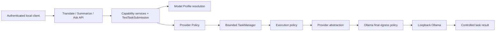

# Current Architecture — K1 Deterministic Knowledge Foundation

## K1 implementation architecture — Closing Candidate

既有 React → typed allowlisted WPF bridge → application-owned RuntimeClient → Runtime
production chain 保持。Knowledge 独立于 Memory/Conversation/Finance；独立
`knowledge/knowledge.db` schema v1、`sources/<document UUID>/<revision>.source`、
task-owned `staging/` 与 owner-only `knowledge.lock`。每个 data root 只允许一个
Knowledge writer Runtime，防止跨进程 ingestion/reconciliation 竞争；Memory 实现未变。
Known schema DDL、FK/quick_check、READY source/representation digests 启动时 fail closed 验证。

Versioned TXT/Markdown parser 去除起始 BOM 并统一 CRLF/CR 为 LF，保留其余文本；
Markdown ATX headings/fenced blocks 只构成文本 section，不执行 HTML/链接/图片。
Normalized text 与 typed locators 是 DB authoritative immutable state，不建立检索索引。
4096 UTF-16 units 的 preview range 限于单个 locator，普通 bridge 64 KiB 上限保持。
Source revision 与 parser/normalization version 分离；optimistic metadataVersion 和
sourceRevision 在 native/JS DTO 中为 canonical decimal strings。

Admission 使用一个 worker、四个排队名额，上传共用五个 bounded slots；最多 40 MiB
upload staging。新 source publication 再次检查 retained/corpus/artifact quotas；在 quota
已满时仍允许同 Document 同 digest 的 controlled no-op。Durable request state 用于
read-only unknown-outcome reconciliation；终态历史有界，仅保留每个 Document 的最新 job。
Crash 后不自动 replay；PENDING/PARSING 转 INTERRUPTED；只清理 journal 明确拥有的对象。
Filesystem rename + SQLite commit 不声明为单一事务；READY DB publication 完整、旧 pointer 保留。
Physical delete 使用 durable journal + same-volume rename；锁定源产生可重试 controlled incomplete。

新增 explicit `knowledge.list/get/import/importState/cancelImport/archive/restore/delete/preview`
和 `native.openKnowledgeBackup`；最多 500 Document / 505 import identities 的 session authority，
rotation 清空、delete 撤销、late response 不发送。React 不接收 path/upload/backup bytes。
`knowledge.get` 使用明确的 WebView revision projection，仅暴露 UI 使用的
`sourceRevision` / `sourceType` / `byteLength`；不暴露 `sourceDigest` / `representationDigest`、
`parserVersion` / `normalizationVersion` / `lineCount` 或其他无 UI 需求的 revision 字段。
Runtime/native 完整 revision DTO 保留；`knowledge.preview` 的 parser/normalization version contract 保持。
Browser route/capability/CORS 未扩权，仍 Translate-only。Knowledge 无 AI/Ollama 依赖。

Knowledge Backup v1 为无压缩的严格 framed binary container，包含小型 typed metadata、
原始源字节、normalized UTF-8、locator artifacts、version/pointer/digests；不含文件路径。
不接收 archive entry/extraction path。Unknown fields、duplicate identities、invalid lengths、
version/digest/text/locator/pointer mismatch 均拒绝。Decoded hard ceiling 2 GiB + 256 MiB +
32 MiB = 2449473536 bytes；source/text/locator buffers 分别有界，不把 corpus 读入 RAM。
Restore 在指定新/空 target 下 private staging reconstruct/verify，再 atomic directory rename
发布 inactive Knowledge；不 merge/hot-swap/自动切换。Workspace Backup v1 保持 Memory + Conversation。

Finance integration deferred pending authoritative Finance Reality Sync.
K0 — APPROVED — GO；K1 — IMPLEMENTED / LOCAL ACCEPTANCE PASS；K1 CLOSING CANDIDATE — GO。
Remediation candidate `01657440fc6ab4e83f716251bde8cda6e693b6c9`：Java 123 / Desktop 269 / Frontend 115 PASS；
真实 Windows 21 coverage points / 116 assertions、独立恢复与隐私 PASS。
K2/K3/K4 — NOT STARTED。[K1 Closing Report](../milestones/K1-CLOSING-REPORT.md)。
ADR-011 Accepted 来源为既有 Architecture Guard approval。K1 closing 仍需独立批准。

以下章节为 M5 及更早交付快照；其旧 allowlist/Knowledge 范围不覆盖上述 K1 实施状态。

## Current M5 approved product architecture and portable packaging

**M5 — Unified Main Workspace UI：CLOSED — GO。M5A / M5B / M5C / M5D / M5E — CLOSED — GO。M5 FINAL CLOSING — APPROVED — GO。** Architecture / Final Closing Review has formally approved the final architecture. ADR-001..010 — Accepted; no new ADR or durable architecture.

React Main Workspace is the main product surface for Assistant / Conversations / Memory / Translate / Settings. WPF owns application lifecycle, single instance, tray, WebView2 host/security, selection/UIA/controlled clipboard/helpers, global hotkey, Quick Assistant/fallback, MemorySelectionWindow, credential flow, Browser Pairing, Memory Backup, Workspace Backup and native dialogs/confirmations. Runtime owns durable Memory / Conversation, TaskManager, context assembly, provider policy, Ollama execution, backup semantics and SQLite. Normal launch, second-instance activation, release launcher, tray double-click and primary Open all target MainWorkspaceWindow. Legacy Assistant is Quick Assistant / fallback, not the main product window. Missing credentials leave Main Workspace open with safe status and explicit native import.

The JS-accessible native allowlist is exactly `native.openCredentialFlow`, `native.openBrowserPairing`, `native.openMemoryBackup`, `native.openWorkspaceBackup`. `native.openLegacyAssistant`, `native.openConversations`, `native.openMemory` are retired from WebMessage admission and fail closed as unknown methods. WPF fallback/hotkey still call native flows directly. Domain methods, origin/session/schema/budget guards, Runtime sole truth and Browser Translate-only permissions stay unchanged.

`scripts/package-windows.ps1` publishes self-contained Release/win-x64 WPF with bundled verified React and packages the existing application JAR without JRE. Ignored output includes launcher, prerequisites README, real component versions/commit/build timestamp and SHA-256 manifest. Release launcher runs only package/service/state preflight and starts/reuses services/Desktop; no developer tools, source build, install, model download or automatic WinCred import.

Java 21, installed Ollama/configured model and Evergreen WebView2 remain external requirements. Runtime is externally owned; launcher startup does not create a supervisor or exit-time service ownership. Readiness plus authenticated native provider contract is required for reuse, otherwise fail closed without killing unknown processes. Workspace data defaults to existing `${user.home}/.personal-ai-workspace/data`; auth/browser registry/logs use owner-only `%LOCALAPPDATA%/PersonalAiWorkspace/RuntimeState`, outside package/repository/data. WebView keeps its separate fixed private profile.

Portable Windows Release Bundle — validated. It contains self-contained .NET Desktop, bundled production React, the Runtime application JAR, release launcher, README, manifest and SHA-256 checksums. The fixed accepted payload identity is implementation commit `bcf7d5f8e20c05e516ae22cbff40d17a18567222`; historical closing docs `82fb7d4cf7ae2f7b518a79b64c5c4c828f030e3b` and the separate `docs: approve M5 unified workspace final closing` commit change documentation only. Package payload identity ≠ final docs-only repository HEAD; the package is not rebuilt for approval sync. Formal Delivery publishes source main only, with no tag, GitHub Release or ignored package upload; artifact publication remains a separate decision.

Unsigned portable folder, no installer/MSI/MSIX/updater/code signing, no bundled JRE/Ollama, plaintext local DB/backups and no cloud sync are accepted limitations, not unfinished M5 work. Java 21 required; Ollama required; configured model required; WebView2 Evergreen required. Ordinary Assistant Ask = stateless; Conversation = durable multi-turn; Memory = manual/user-controlled; explicit Memory = exact revision; Browser = Translate-only. No automatic Memory, semantic retrieval, RAG, Knowledge, Finance, Agent/Tools, streaming or edit/regenerate/branching.

The approved fixed implementation package passed real Windows entry/tray/single-instance, Ollama, native Pinyin, durable Conversation, Memory, explicit context, hotkey/UIA, Workspace recovery, native maintenance and renderer/asset fallback acceptance. Runtime/Browser/schema/Core ownership code did not change. Published automated baseline: Java **105 PASS** / Desktop **258 PASS** / Frontend **106 PASS**; the final full automated regression was run once before Architecture / Final Closing Review. Package security checks 13 PASS; full privacy/package/UDF audit 0 unexpected matches. Exact evidence, limits and package hashes: [M5E Closing Report](../milestones/M5E-CLOSING-REPORT.md), preserved with its accurate candidate / M5 OPEN snapshot.

No full test suite or Windows acceptance was rerun during Final Formal Delivery.
The published evidence is inherited from the approved M5E / M5 Final Closing Candidate.
Approval sync changes only README, STATUS and current architecture; historical Closing Reports and ADR bodies remain unchanged. Delivery verification uses diff/diff --check, fresh remote baseline, ancestry, fast-forward-only merge, push main, post-push fetch and clean working tree.

## Approved M5D implementation history

The following sections preserve earlier review/delivery snapshots; their OPEN / NOT STARTED references and old bridge lists describe those earlier phases. Current M5 CLOSED — GO status and final ownership/entry/allowlist are specified above.

## Historical M5D Memory and Settings approval

**M5D — CLOSED — GO. M5D Architecture / Closing Review: GO. M5 — OPEN. M5E — NOT STARTED.**
M5A/M5B/M5C remain CLOSED — GO. Pre-delivery published main: `4f97a03f4317f02370e2a5bb10f80eb7ce6ad61d`, verified against local main and live-fetched origin/main from the clean M5D branch.
Implementation: `6e6423dc552e2578e22753c16101e55240cc099e`; historical closing docs: `c7c151c05e3ed4348c3faab2b47d900309097a71`, verified by actual git log.
Approval sync is the separate `docs: approve M5D memory and settings migration` commit. Delivery requires fresh remote baseline, ancestry, fast-forward-only merge, push main and post-push fetch before safe local feature cleanup; existing history is not rewritten.
No new ADR: ADR-001..010 remain Accepted. Java/Core production, API, SQLite schema, backup formats, security/Browser permissions and domain limits are unchanged.

```text
React Memory → typed WPF bridge → application-owned RuntimeClient → native-only Runtime API → SQLite
React Settings → safe shell status / fixed native entries → existing WPF maintenance
```

Runtime = sole durable Memory truth, backed by SQLite. React keeps only the current metadata page, explicitly loaded snapshot, editor draft, filter/search state, dirty/stale/missing state and presentation state in RAM.
Approved Memory capabilities: ACTIVE / ARCHIVED, PREFERENCE / PROJECT_NOTE, literal search/filter, 20-item bounded pagination, metadata-only list, explicit get, create, manual edit, explicit Save, Reload, archive, restore, physical delete, dirty-edit protection and native Memory Backup entry.
No autosave, automatic extraction/search/selection, semantic search, RAG, second database, browser domain storage, content/IDs/query in URL or direct HTTP.
`WorkspaceMemory` keeps only bounded session authorization; list/create authorize real IDs, delete revokes, document rotation clears authority and suppresses late replies.
At most1000 authorized Memory IDs; list always20, page0..49, no preload-all path. Runtime lists retain their existing full contract; the Host projects exactly
`id,type,title,status,revision,source,createdAt,updatedAt` before posting to JS. `memory.list` never returns `content`; reading a body requires explicit `memory.get`.
Confirmed create/update/archive/restore responses may also return the full snapshot. Metadata-only list is the approved M5D privacy / least-data baseline.

The exact v1 additions are:

```text
memory.list
memory.get
memory.create
memory.update
memory.archive
memory.restore
memory.delete
memory.editorState
```

`memory.editorState` is strictly `{dirty:boolean}` with `{acknowledged:true}`; no text, logging or durable state. It protects real native close/reload.
It carries no title, content, Memory body, path or credential. The bridge remains typed, versioned, allowlisted, origin/session checked and bounded.
Existing origin/document/session/requestId checks, strict schemas, 8 pending,4096 request IDs,32KiB requests/64KiB responses remain.
Only existing `conversations.get` retains1MiB. Legal worst escaping fits Memory budgets, with serialization tests; no truncation or enlarged global limit.
Memory revisions are canonical positive decimal Int64 strings from invariant .NET `long`, including values above JS safe integer, without Number conversion.
Update/archive/restore/delete use `expectedRevision`, covering the full positive Int64 range; no last-write-wins, force overwrite, automatic merge or automatic retry.
Core validates title160 scalars, body2000 scalars AND2000 UTF-16 AND8192 UTF-8, query160, valid Unicode/no NUL and1000 domain capacity.
Search stays explicit button/Enter, literal case-sensitive title/content substring: existing FTS5 trigram for >=3 scalars, instr for shorter, no SQL/FTS syntax from JS.

Create/Update happen only on Save. Exact draft is compared with loaded type/title/content; no normalization/truncation.
Archive/Restore with dirty fields update loaded status/revision while preserving draft; next explicit Save uses that new revision, including editing ARCHIVED items as in MemoryWindow.
Archive / Restore ≠ Save: lifecycle mutations update durable status/revision, and only a later explicit Save persists the local draft.
Conflict preserves draft, marks stale and blocks mutation until explicit Reload/discard. Missing preserves draft, blocks the old identity and never auto-recreates.
Approved real conflict: React loads N → Runtime changes to N+1 → stale Save N → `MEMORY_REVISION_CONFLICT` → exact local dirty draft preserved → stale / mutations blocked → explicit Reload required.
Delete has a default-safe confirmation stating physical irreversible Workspace deletion, dirty discard and no forensic erasure guarantee.
Mutation timeout/transport/unverifiable response means Outcome unknown, freezes mutations and never retries; confirmed success with failed follow-up list is reported separately.
Search/filter/refresh/page changes preserve draft. Selection/New/Reload/route use a labelled modal with Cancel focus, Escape, focus trap/return.
Native close/document reload ask Yes/No with defaultNo before cleanup/session rotation; decline keeps the same document/session/draft. Renderer failure retains native dirty state.
Approved dirty protection covers selecting another Memory, New, Reload, route away, Main Workspace close and trusted document reload. Cancel preserves the exact draft; confirmation permits discard. Drafts are not persisted in browser storage.
Session changes clear presentation and dialog state; generation guards prevent late old-session responses/errors from repopulating UI.

Settings shows safe applicationVersion, Runtime reachability, credential enum, WebView state and Refresh; reachability/authentication are not all-model readiness.
Fixed native credential, Browser Pairing, Memory Backup, Workspace Backup and legacy Assistant entries reuse existing production windows.
Bearer, pairing proof, file path, backup bytes, runtime data path and provider/model settings stay native. No configuration mutation bridge or process manager.
Settings has no model/provider selector, Ollama URL/temperature/system prompt editor, Runtime supervisor/process restart, auto-start toggle, cloud settings or sync settings.
SQLite/backups remain plaintext protected by the OS account boundary; same-account/admin process isolation and forensic erase are not promised.
Native file choices + file IO + Runtime-owned validation/restore remain ADR-006/007 workflows, new/empty target only, no hot replacement/switching.
WPF/native retains ownership of Windows Credential Manager, Browser pairing secrets, file pickers, backup paths/bytes and restore validation orchestration; React owns only fixed entry invocation and safe status.
Memory Backup remains native/plaintext/new-or-empty-target/no-merge/no-hot-swap. Workspace Backup remains Memory + Conversation portable logical state; M5D changes no format/schema.
Browser companion remains Translate-only: no Browser Memory, Conversation or Workspace Backup; no CORS or permission widening.
Theme remains the only localStorage domain exception. Memory/Conversation/drafts/search use no localStorage, sessionStorage, IndexedDB, service worker, Cache API or content-bearing URL.
All legacy windows, MemorySelectionWindow and M5B/M5C explicit selectors remain in place.
Published test baseline, approved by Architecture / Closing Review: Java **105 PASS** / Desktop **251 PASS** / Frontend **103 PASS**, no failures/errors/skips; approved default Release build/publish safeguards PASS.
Formal Delivery did not rerun the full acceptance suite. Published test evidence is inherited from the approved M5D Closing Candidate.
This delivery changes current docs only; verification is limited to Git diff/diff --check, ancestry, remote freshness, fast-forward delivery, post-push refs and clean working tree.
Real Windows Memory title/body Pinyin, CRUD/search/paging, conflict/missing/dirty/native guards, actual Settings and isolated native Memory/Workspace recovery PASS.
M5A/B/C, hotkey/UIA/clipboard, legacy Memory, Workspace Backup and Translate-only Browser synthetic HTTP/real Ollama regressions PASS.
**REAL WINDOWS PINYIN — PASS; REAL MEMORY CRUD — PASS; REAL LITERAL SEARCH / FILTER / PAGINATION — PASS; REAL REVISION CONFLICT — PASS; DIRTY EDIT PROTECTION — PASS; MEMORY BACKUP / RESTORE — PASS; WORKSPACE BACKUP REGRESSION — PASS; PRIVACY / UDF AUDIT — PASS.**
Approved production Memory title and content textarea Pinyin: actual composition → committed Chinese → explicit Save → Runtime durable exact value → Get / Reload exact value.
UDF and fresh-marker/source/build/log/evidence/archive privacy audits PASS, inherited from the approved candidate.
See [M5D Closing Report](../milestones/M5D-CLOSING-REPORT.md) for all62 sections, measured performance and explicit acceptance limitations. It retains the accurate historical IMPLEMENTED / LOCAL ACCEPTANCE PASS, CLOSING CANDIDATE — GO, M5 OPEN and M5E NOT STARTED snapshot; M5A/B/C closing reports and ADR-001..010 bodies are unchanged.
At M5D delivery, M5 remained OPEN because M5E — Product Consolidation / Packaging / Final Acceptance was NOT STARTED. Current M5 final approved status is specified above.

## M5C approved implementation history

**M5C — CLOSED — GO. M5C Architecture / Closing Review: GO. M5 — OPEN.**
M5A/M5B were CLOSED — GO. M5D/M5E had not started at M5C approval and M5 was OPEN; current M5 final approved status is above.
The following records M5C approval sync and formal delivery history.
Pre-delivery published baseline `7b6dbdfeece1d4ab8179ec6cd5ce7f730e6aee14`; implementation branch `m5c-conversations-migration`.
Implementation `084171306874f36166077b44dcd0143502ed66c5`;
historical documentation / closing `8edf0a71876618e7f2db9662756fbb6b71173699`, verified by real git log.
Architecture approval uses the separate `docs: approve M5C conversations migration` commit.
Formal delivery requires fresh remote baseline verification, ancestry PASS, fast-forward-only merge,
push main and post-push fetch before safe local feature branch cleanup; existing commits are not rewritten.
ADR-001..010 remain Accepted. Java/Core production, Runtime API/schema, backup format and Browser permissions are unchanged.

Runtime = sole durable Conversation truth. React owns presentation, one bounded list page, one history
page, latest pending identity, draft/selection/focus/loading/error state. All are process memory only.
React owns no durable transcript, second database, IndexedDB Conversation truth or localStorage Conversation history.
Conversation content remains in-memory presentation only. localStorage only stores theme; there is no
IndexedDB/sessionStorage/service worker domain state, transcript accumulation or content/identity in URLs.
The route remains `#/conversations`. Assistant is stateless; M5B WorkspaceOperations remains
independent: the M5B transient operation registry is **not used as Conversation truth** and owns no
Conversation task, transcript, recovery or shutdown cancellation.

`WorkspaceConversations` uses the application RuntimeClient and native MemorySelectionWindow.
The eleven explicit methods are:

```text
conversations.list
conversations.get
conversations.create
conversations.rename
conversations.archive
conversations.unarchive
conversations.delete
conversations.selectMemories
conversations.clearMemories
conversations.send
conversations.cancelPending
```

The bridge remains typed, versioned, allowlisted, origin/session checked, with strict payload schemas
and session-authorized IDs. There is no generic CRUD, generic HTTP, SQL or task-by-ID proxy.
List/create authorize returned canonical IDs in the current WebView session, bounded to1000.
Read/mutation/picker/send/cancel require those IDs; delete revokes them; new document resets all.
Raw Runtime taskId is not exposed to React. React cancel submits conversationId + turnId;
WPF Host verifies real Runtime detail and binds the internal taskId + page, then rechecks that same
durable PENDING binding immediately before calling the existing cancel API. Terminal truth wins races.
JS receives turnId/status/canCancel, never raw taskId or credentials, and owns no Runtime task authority.
Projection contains safe metadata, USER/ASSISTANT messages and historical ordered decimal refs,
with no Memory body/current-Memory lookup, provider payload, system prompt or context assembly.
TypeScript validates exact fields/IDs/enums/UTC timestamps/calendar ranges/counts/order/roles/
assistant invariants/string and UTF-8 bounds; no raw task field is accepted.

Requests remain 32 KiB, ordinary bridge responses **64 KiB**, 8 pending and 4096 consumed request IDs per document.
Only `conversations.get` Conversation detail has a **1 MiB hard ceiling**, based on legal page worst-case.
Worst content bound is
20×8192×6=983040bytes, plus≤1920title bytes and≤40KiB DTO/envelope overhead, within1048576.
Automated native maximal-page and TypeScript/React tests, plus real serialization/render validation
(988644-byte WebMessage), preserve every character; oversized responses
produce a controlled failure, never substring/drop/incomplete success. Runtime limits are unchanged.
There is no silent truncation; the 1 MiB ceiling does not apply to other bridge responses.
Conversation list is **10 per page** and Conversation history is **10 turns per page**, pages0..99.
Default opening reads **page0 + latest page when needed**, without preloading all 1000 Conversations or 1000 Turns.
Polling serializes durable detail requests, waits550ms after completion, and stops
on terminal/error/hidden route; an older visible page is not replaced or appended by latest probes.

Conversation Memory is explicit per-turn through native MemorySelectionWindow, with exact revision and max 4.
Picker authorization binds session+conversation and exact ordered refs using Int64 decimal revisions.
Switch/clear/archive invalidate selection. Accepted admission and unsafe POST errors
consume selection authority; the next Turn has no automatic carry-over. Definite pre-admission stale
retains Needs review until explicit reselect/clear. Historical refs may dangle; the UI never queries
current Memory to fabricate historical title/body.
Preflight authority is checked again after await and before POST, so an in-flight clear cannot send
revoked refs. Durable send continues independently of the WebView document token. Lost/unverifiable
admission returns OutcomeUnknown, preserves the draft, clears unsafe selection, refreshes Runtime,
and never retries. Error responses can follow a persisted FAILED USER; history is always refreshed.

Approved React Main Workspace Conversations supports ACTIVE / ARCHIVED, paged list, create, manual rename,
paged durable history, per-turn explicit Memory, send, PENDING, cancel, archive, unarchive, delete,
durable failure states and WebView reload / Workspace reopen / Runtime restart fail-closed recovery.
ACTIVE/ARCHIVED lists have separate in-memory page indices. Manual title uses existing160 Unicode
code-point validation; editor retains exact multiline input under3000UTF-16/5632UTF-8 admission
bounds. Native composition/keyCode229 guards cover Ctrl+Enter and explicit Send.
Archive changes ACTIVE → ARCHIVED and blocks new turns; it **does not cancel accepted PENDING execution**.
Archived PENDING remains observable. Unarchive returns the same Conversation ID to ACTIVE.
Delete is physical irreversible delete, requiring keyboard modal confirmation and default Cancel.
Runtime conflict blocks delete while PENDING; there is no cancel-then-delete or force delete.
History renders PENDING/SUCCEEDED/FAILED/CANCELLED/TIMED_OUT as plain text; only SUCCEEDED has
ASSISTANT. Failure labels use the existing seven controlled codes; historical refs may dangle.

WebView reload: PENDING → session rotates → reload durable detail → pending rediscovered → no replay → terminal observed.
Main Workspace reopen: no auto cancel, no resend; reload from Runtime.
Runtime restart: stale PENDING → FAILED / EXECUTION_INTERRUPTED → no provider replay.
Original-unavailable logical restore
preserves source fields; React reads the restored Workspace and continues real contextual dialogue.

Published M5C test baseline, approved by Architecture / Closing Review:
Java **105 PASS** / Desktop **233 PASS** / Frontend **66 PASS**, 0 failure/error/skip.
This approval sync / formal delivery records existing acceptance; suites and real Windows gates are not rerun.
**REAL WINDOWS PINYIN — PASS** in the production Conversation textarea:
Pinyin → committed Chinese → conversations.send → exact durable USER → exact provider USER.
Real Release WPF/WebView2/bundled React/Runtime/SQLite/Ollama acceptance is approved:
**REAL MULTI-TURN OLLAMA — PASS; DURABLE RELOAD / REOPEN / RESTART RECOVERY — PASS.**
Real explicit Memory, archive/unarchive, cancel and failure gates also PASS.
Main shell/old business/native quick path/UIA/clipboard/Memory/backup/Browser regressions PASS.
Plain text rendering and **UDF privacy scan PASS**: 374 UDF files and source/build/nested archives/log/evidence,
0 content/credential matches; no concrete private markers are recorded here and no forensic erasure is claimed.
All legacy windows remain, including `native.openConversations` fallback. Memory management and
full Settings were native at M5C delivery; that historical scope included no M5D/M5E work.
Full60-section evidence, reproducible commands, observations and limits:
[M5C Closing Report](../milestones/M5C-CLOSING-REPORT.md). It retains its accurate historical
M5C — IMPLEMENTED / LOCAL ACCEPTANCE PASS, M5C CLOSING CANDIDATE — GO and M5 — OPEN snapshot;
post-review formal status is recorded in current docs, without rewriting the closing report.

## M5B accepted Assistant / Desktop Single Translate history

M5B is **CLOSED — GO**. **M5B Architecture / Closing Review: GO.**
The implementation branch is `m5b-assistant-translate-migration`, from the pre-delivery published baseline
`8bf5aac70630fae730ea5ba1d101b42a5e277af5`. At M5B approval, M5 was **OPEN** and M5A was **CLOSED — GO**.
M5C approved implementation history is recorded above; current M5 final approved status is at the top. ADR-001..010 remain Accepted. No new ADR or Runtime/Browser permission change.

Bundled React owns two production controlled editors: Assistant Ask/Summarize and Desktop
Single Translate (zh-CN/en/ja, existing native choices). Input, selection metadata and plain-text
results exist only in bounded presentation state. Enter/Shift+Enter insert a newline; Ctrl+Enter
submits only outside native/React composition and keyCode229. Buttons remain explicit paths.
No Markdown/HTML, direct HTTP, browser clipboard, domain storage, replay or automatic Memory.
Assistant supports ordinary Ask, Summarize and explicit Memory Ask, with submit / polling / cancel /
terminal result / native-owned Copy Result. Translate supports target language, submit / polling /
cancel / result / copy. Browser DOM/Batch/Dynamic/Restore remain owned by the Browser companion.

The existing v1 bridge adds exactly `assistant.selectMemories`, `assistant.submit`,
`translate.submit`, `operations.get`, `operations.cancel`, `operations.copyResult`.
Exact payload/field/duplicate/enum/bounds/origin/document/session/requestId checks still apply.
The bridge remains typed, versioned, allowlisted, origin/session checked and bounded, with no generic proxy.
M5B introduced no Conversation or Memory CRUD bridge; later M5C/M5D add explicit methods separately. Settings configuration mutation remains absent.
Requests retain32KiB; replies allow64KiB because a verified8192-byte result can JSON-escape to49152bytes.
Eight pending requests /4096 consumed IDs per document remain. No task IDs, bearer, provider/model/
profile/systemPrompt/history/endpoint/path/HTTP/native generic proxy crosses the bridge.

Application-owned WorkspaceOperations reuses the application RuntimeClient and shared
AssistantOperation poll/cancel/deadline/best-effort cleanup; the native and React paths share
execution semantics. Only accepted tasks enter the registry. Opaque UUIDs bind session, capability,
Runtime task ID/prompt version and transient verified state/result. Admission reserves capacity;
at most16 accepted/reserved operations. Active entries never evict. Terminal/error entries expire
after2minutes on access or the30s cleanup timer. No durable store/history or raw diagnostics.
operations.get returns the shared runner's strictly validated Runtime snapshots; no second poller.
Copy admits only the current session's owned SUCCEEDED verified result. Cancel acknowledges a
request and Runtime decides terminal truth; cancellation does not guarantee immediate GPU stop.
Routes/reload/close do not cancel accepted tasks; app exit reuses bounded best-effort cancellation.
Reload rotates session, suppresses stale replies, loses presentation state and cannot replay.

The native MemorySelectionWindow remains the only picker/preview. Host selection authority
rejects forged/out-of-order/changed references. React receives title/memoryId/decimal Int64 revision/
position only, never Memory content/collection. Ask with selected references uses Memory Ask;
zero references uses ordinary Ask. Summarize never takes Memory. Accepted admission consumes host
and React selection immediately; pre-admission stale retains UI until explicit reselect/clear.
POST transport/deadline/unverifiable reply marks shared admission outcome unknown without changing
underlying RuntimeClient errors. UI shows safe Outcome unknown; neither path automatically resends.
Ordinary Ask is single-turn / stateless / no Conversation persistence. Summarize is stateless /
no Memory / no Conversation. Explicit Memory Ask is explicit-only / exact revision /
native Memory selector authorization / no automatic retrieval.
Ordinary Ask/Summarize/Translate do not read/write Conversation or save Memory.

Real Release WPF/WebView2/bundled React/Ollama business flows PASS. **REAL WINDOWS PINYIN IME — PASS**
in the production Assistant editor: physical keyboard input, native candidate selection and
commit, no submission during candidate Enter, exact React/bridge/Runtime provider-input assertions
in test-owned memory, one admission and real Ollama completion. The approved chain is:

```text
Pinyin composition → committed Chinese text → explicit Submit → React exact value → WPF bridge exact input → Runtime/provider exact input → real Ollama completion
```

No synthetic composition/value
insertion/clipboard substitution is counted as this gate. InPrivate UDF business scan:303files,
0 matches; synthetic input/result/title/Chinese marker and temporary bearer. No forensic erase.
Approved final acceptance baseline: Java **105 PASS** / Desktop **197 PASS** / Frontend **33 PASS**.
This approval sync and formal delivery record the existing acceptance results; the full suites are not rerun.
Native WPF Ask/Summarize, hotkey/UIA Translate,
security shell, Workspace/Memory-only recovery and Browser Translate-only protocol/real Ollama regressions PASS.
Implementation: `8bfc362196233297302997bf23cf9052147ef2f9`;
historical documentation / closing: `e456030df3c4e01ced11d28c21e3f4c95a057d50`.
Approval uses a separate docs commit. Formal delivery requires fresh remote baseline verification,
ancestry PASS, fast-forward-only merge, push main and post-push fetch before local branch cleanup.
Full evidence and limitations: [M5B Closing Report](../milestones/M5B-CLOSING-REPORT.md), preserved with its
historical IMPLEMENTED / LOCAL ACCEPTANCE PASS, CLOSING CANDIDATE — GO and M5 OPEN snapshot.

## M5A accepted foundation and historical acceptance

At M5A approval, M5 — Unified Main Workspace UI was **OPEN**; M5A — Main Workspace Shell Foundation was **CLOSED — GO**.
**M5A Architecture / Closing Review: GO.** ADR-001..010 are Accepted, including ADR-008/009/010.
M5B — Assistant + Desktop Translate Migration: **CLOSED — GO**; M5C — Conversations Migration: **CLOSED — GO**;
M5E — Product Consolidation / Packaging / Final Acceptance was **NOT STARTED** at this historical stage; current M5 final approved status is at the top.
Final M5A acceptance baseline: Java **105 PASS** / Desktop **168 PASS** / Frontend **14 PASS**.
The historical M5A approval sync recorded existing acceptance results without changing implementation or tests.
WPF owns lifetime/single instance/tray/hotkey/UIA/clipboard/helper processes/WinCred/dialogs,
WebView2 lifecycle/focus and bridge security. React owns shell layout/navigation/presentation/
loading/errors/focus and session-local theme. Runtime owns durable Memory/Conversation,
execution/TaskManager/context/provider/Ollama/backup validation/SQLite. Core has no WebView2 dependency.

Production chain: bundled React / TypeScript / Vite → typed allowlisted WebMessage bridge → existing WPF-owned
RuntimeClient → external Runtime. The five routes are Assistant, Conversations, Memory, Translate and Settings.
The fixed virtual HTTPS origin exposes only validated frontend build output, with strict CSP/resource policy.
External navigation, frames, popup/new window, downloads and permissions are denied; production DevTools are disabled.
The bridge is versioned, typed, allowlisted, bounded and origin/session validated, with stale response suppression.
Bearer, Browser credential, pairing proof, backup bytes/paths and arbitrary native capabilities
never enter JS. React does not directly call Runtime. No CORS widening occurs; Browser remains Translate-only.

M5A introduced safe bootstrap/status and seven explicit native entries. M5B business methods are
listed above; every legacy window remains. Tray Main Workspace is explicit; quick native Assistant,
single-instance activation and the selection hotkey retain their existing behavior. No production surface is retired;
incremental migration remains required. M5A had native Memory CRUD/maintenance; current explicit Memory migration is described above. Settings configuration mutation remains absent.

The complete M5A allowlist remains:

```text
shell.bootstrap
shell.refreshStatus
native.openLegacyAssistant
native.openConversations
native.openMemory
native.openBrowserPairing
native.openMemoryBackup
native.openWorkspaceBackup
native.openCredentialFlow
```

Dedicated account-private MainWorkspace InPrivate profile, disabled autofill/password saving,
controlled AllProfile cleanup and synthetic UDF evidence establish the practical privacy boundary.
React is not authoritative storage for domain data; USER/Memory logging, remote analytics and CDN are absent.
The synthetic UDF marker scan passed with zero matches; there is no forensic erasure claim.
Missing WebView2/assets or initialization/page/process failures
provide native fallback. External Runtime mode and process ownership are unchanged.

Frontend npm/lockfile/Vite production assets are built and verified by Desktop build/publish;
ordinary users need no Node/Vite. Explicit fixed-loopback Debug development compiles out of
Release. Distribution provisioning, installers and supervisors remain deferred. Retirement
requires a later scope, equivalent security/privacy/regression/Windows acceptance and review.

Chinese rendering / keyboard / focus / composition plumbing **PASS**. Actual Windows Pinyin IME
was not established during M5A acceptance; synthetic composition events do not prove real IME acceptance.
Architecture Review decided this is **NOT an M5A blocker**, because the production M5A shell has no domain text editor.
Native Pinyin IME was **DEFERRED TO M5B HARD CLOSING GATE** during M5A approval.
The M5B production React Assistant editor has now passed the real Windows Pinyin chain recorded above,
including exact Runtime/provider input and real Ollama completion. **REAL WINDOWS PINYIN IME — PASS**
is approved by M5B Architecture / Closing Review. Synthetic composition does not replace real acceptance;
M5A's historical synthetic input probe remains separate evidence. Test phrase/body is not recorded here.

Historical implementation and evidence: [M5A Closing Report](../milestones/M5A-CLOSING-REPORT.md).
That report retains its accurate IMPLEMENTED / PARTIAL / AWAITING REAL WINDOWS IME ACCEPTANCE snapshot;
the current formal status and Architecture Review gate reclassification are recorded here and in [STATUS](../STATUS.md).

**M4 — User-Controlled Conversation Foundation：CLOSED — GO。**
M4A — CLOSED — GO；M4B — CLOSED — GO；M4C — CLOSED — GO。
Architecture / Closing Review：**M4 FINAL CLOSING — APPROVED — GO**；ADR-001..007 — **Accepted**。

## M4 final architecture

- Conversation Domain：durable、linear、immutable，SQLite Workspace-owned；Conversation ≠ Memory ≠ transient Task。
- Execution：persist USER before execution → shared bounded TaskManager → LOCAL_ONLY Ollama → terminal outcome persistence。
  cancel/timeout 与 stale-result rejection 保持；startup PENDING fail-closed reconciliation，不 replay。
- Context：Runtime-owned system → explicit current-turn Memory → prior complete SUCCEEDED Turns → current USER once；bounded context window。
- Memory：explicit per-turn only，exact revision snapshot；无 automatic retrieval/save/extraction。
- Recovery：Workspace logical backup v1 = Memory + durable Conversation；Memory-only ADR-006 remains independent，format1/schema1不变。
- Restore：new/empty target only；no merge、no overwrite、no hot swap、no auto switch；restored Conversation可继续，Memory仍须显式选择。
- Portable：logical source data only；Task state not portable，无 taskId/PENDING/live Task restoration。
  Workspace DB schema version 与 logical format/section versions 独立。
- Browser：Translate-only；Ordinary Ask：single-turn/stateless；native-only personal-data APIs，plaintext warnings。

Final closing evidence：Java105/Desktop136、real Windows/WPF/HTTP/SQLite/Ollama recovery/continue、ADR-006 compatibility与privacy/security **PASS**。
历史Closing Reports保留当时的candidate/OPEN及Git记录；正式发布另须实时remote验证、ff-only merge、push/post-push fetch。
M4 closing 时 Main Workspace 尚未开始；当前 M5C Conversation migration、M5B业务与M5A shell基础见页首。
Finance integration / Reality Sync、Knowledge/RAG/embeddings/vector DB、Agent/Tools/TOOL role、Browser Conversation、streaming、
edit/regenerate/branching、automatic Memory、cloud/encrypted/scheduled/incremental backup、multi-device sync仍未实现。
M5A / M5B / M5C / M5D / M5E Architecture / Closing Review 已 GO；M5A / M5B / M5C / M5D / M5E CLOSED — GO；M5 CLOSED — GO，M5 FINAL CLOSING — APPROVED — GO。

## M4C current architecture

[ADR-007](../ADR/ADR-007-logical-workspace-backup-restore.md)已Accepted，完整定义独立portable contract。
ADR-006仍Accepted，Memory-only format1/schema1/fresh-v1 restore保持；Workspace DB仍v3，无新增migration。
Workspace format1包含Memory source + Conversation terminal history，不包含taskId/PENDING/transient execution。
同一SQLite read transaction提供counts/digest/streamed export；SHA-256采用排序后的length-prefixed UTF-8 canonical values。
严格逐条解析至private staging v3 DB，单transaction写入，read-back canonical equality、FK/FTS/search/quick_check后commit/close。
复用ADR-006 path validator/publisher，new/empty target、same FileStore/no-replace、no active hot swap；failure只清理task-owned staging。
Desktop拥有native file dialogs与64KiB file/HTTP stream；完整validation由Runtime执行，再显示仅metadata预览；Restore是单独显式操作。
Native-only GET export / POST validate / POST restore；Browser所有route/method/Origin组合在body/filesystem前拒绝。
Raw restore body避免巨大JSON envelope复制；target通过bounded UTF-8/base64url header传入，request header limit64KiB。
理论安全上限101,393,896,192bytes，完整保留当前domain capacity；大文件需磁盘/时间并可能延迟SQLite writer。
真实isolated recovery中original已删除，恢复逐字段exact、startup0replay、oldTask404、WPF search/reopen/realOllama continue+explicitMemory PASS。
M4 — CLOSED — GO；Finance/Knowledge/RAG/Agent/autoMemory/cloud/sync/scheduler/React/WebView2 Main Workspace仍未实现。

## M4B current architecture decisions

- Conversation ≠ Memory ≠ transient Task。独立native-only POST `/api/v1/conversations/{id}/turns`只接收message和既有Memory ID/revision selector。
  普通Ask/MemoryAsk的endpoint、persona和stateless/no-persistence语义保持；Browser allowlist没有扩权。
- Validation和M3 exact-revision admission snapshot → BEGIN IMMEDIATE验证ACTIVE及无PENDING → 分配sequence → PENDING/USER/taskId/selectionmetadata → COMMIT → 共享TaskManager。
  单Conversation至多一个PENDING execution，避免重叠推理破坏strict linear context；其他Conversation共享原bounded queue/concurrency。
- Task ID提前分配；TaskManager Job持有最小completion callback，绑定Conversation/Turn/Task ID。
  成功/失败/cancel/queue-timeout/execution-timeout/shutdown终态均在同一TaskManager锁内决定，并先执行durable callback再公布terminal Task。
  成功callback事务插入Assistant、更新Turn与parent timestamp；任务只在durable commit成功后报告SUCCEEDED。
  duplicate/terminal/wrongConversation/wrongTask由store guard拒绝，cancel/timeout锁胜出后不调用late-success callback。
- Assistant persistence rollback后以受控storage failure尝试保存FAILED；完全DB outage时Task FAILED/CONVERSATION_STORAGE_UNAVAILABLE且无result，
  durable PENDING不得误标成功，等下次启动fail closed。Storage callback最多沿用SQLite busy_timeout3秒，可能短暂阻塞共享终态锁。
- Submission失败不删USER，保存FAILED及controlled enum；QUEUE_FULL不是timeout。Cancelled/TimedOut只有executionstate，没有伪造Assistant。
  startup在HTTP admission前事务将残留PENDING→FAILED/EXECUTION_INTERRUPTED，不创建task、不调用provider、不重放。
  所有terminal Turn immutable，数据库trigger及service保护；Dedicated Retry=NOT IMPLEMENTED BY DESIGN，显式resend是new Turn。
- Context属于Runtime。`conversation-v1`独立system→当前explicit Memory JSON reference user message→recent complete SUCCEEDED USER/ASSISTANT→current USER exactly once。
  Runtime先验证必需current/Memory，随后按sequence DESC尝试整轮，按ASC输出；超过预算停止接纳更旧历史，不拆分、不截断、不总结。
  不接纳FAILED/CANCELLED/TIMED_OUT/PENDING，不注入title/archive/errors；不跨Conversation检索，没有automatic retrieval/Memory。
- 复用chat.balanced context/output/character配置。serialized messages <=3000 UTF-16；UTF-8预算context-output-templateReserve。
  templateReserve=max(512,escaped system bytes+escaped model bytes+256 wire-envelope reserve)；system<=512。
  因而current+Memory优先且完整，超限controlled400；最终Provider JSON和输出reserve一起受原context预算约束。没有客户端model/context-size配置或tokenizer。
- `TextTaskSubmission.prepareConversation`复用既有profile resolver/registry/policy/output validation；ProviderExecution仅扩展immutable role/content messages。
  Ollama adapter只序列化Runtime已决定的messages，system始终第一；LOCAL_ONLY在admission/work/final egress复核，无cloud/fallback/retry/新executor。
- Workspace DB additive v2→v3：task_id/failure_code、conversation_memory_selections(turn_id FK cascade,position,memory_id,revision)、immutability triggers。
  Memory reference故意无Memory FK：只记录历史selection identity，Memory仍可edit/archive/delete，snapshot正文不复制到Conversation。
  source/FTS/Memory logical format1/schema1/fresh-v1 restore不变；旧Runtime不可打开v3，未知新版本fail closed，migration失败rollback。
- Archive不cancel live Turn，新Turn拒绝；DELETE在同一write transaction发现任何PENDING即409，不自动cancel/cascade竞态。
  terminal aggregate可删除。create/rename/lifecycle/newTurn/terminal更新updatedAt，polling/read不更新。
- Desktop/Core沿用单一RuntimeClient/auth/loopback/no-proxy/no-redirect/JSON limits/strict parsing；只有IDs/reference/request，不拼prompt或读DB。
  Assistant新增Conversation modal，ACTIVE list、plain ordered USER/ASSISTANT/executionstates、paging、send、explicit selector、cancel、refresh/reopen/archive。
  后续Send默认无Memory；stale锁定至explicit reselect/clear；窗口关闭取消HTTP、忽略late结果、清空正文及selection、不保留undo/cache。
  关闭窗口不自动replay/retry/cancel已提交server task；再次打开可刷新durable outcome或Cancel仍PENDING task。
- 只保存controlled failure enum，不保存raw exception/provider body/stacktrace/prompt/secret。
  admission evidence只有sequence/count/input sizes，ToString redacted；无title/Message/Memory/context/provider output日志。SQLite仍本地明文+OS账户权限。

以上长期规则由本架构文档承载；ADR-001..006保持Accepted，ADR-007现已Accepted，未新增通用框架。
M4B当时不实现M4C backup/restore/portable recovery；当前新增能力见上方与ADR-007。无React/WebView2/streaming/RAG/Knowledge/Finance/Agent/Browser Conversation/edit/regenerate/branching。
完整证据与limitations见[M4B Closing Report](../milestones/M4B-CLOSING-REPORT.md)。

## Historical M4A architecture and closing baseline

以下M4A内容保留原scope与形成时未merge/push的记录；正式M4A已交付，当前执行架构以上方M4B为准。

### M4A Conversation Domain & Persistence

**M4A：CLOSED — GO；M4 overall：OPEN**。M4A只建立durable Conversation数据域；
普通Ask仍single-turn/stateless。没有multi-turn AI execution、context assembly、automatic Memory/retrieval、
RAG、Knowledge、Agent、Finance、React/WebView2 Main Workspace、Browser Conversation access、
edit/regenerate/branching、Conversation logical backup/export、restore或portable recovery。

## M4A current domain and persistence decisions

本地implementation`03591f9fe74f3a3db18ca062ae168f21cb668a49`，branch`m4a-conversation-domain`，未merge/push。
Java75/Desktop111 PASS；packaged four-process restart、M3 integrated real WPF/Ollama recovery、
native AI及synthetic Browser Batch回归和privacy audit PASS。没有Conversation portable recovery验收。

- **Conversation ≠ Memory**：实际对话历史和用户明确选择长期复用的Memory是独立实体。
  Conversation不是TaskManager retention；无自动extraction/write/retrieval/search/selection。
  M3 explicit per-turn Memory selection保持原语义，M4A不连接执行链。
- Conversation是私有Workspace SQLite中的durable数据；ACTIVE/ARCHIVED支持显式archive/unarchive，
  title默认New conversation、trim、非空和160 code points上限；DELETE在一个transaction中FK cascade删除整个aggregate。
- Conversation 1:N Turn；Turn持有稳定UUID、conversationId、唯一sequence、timestamps和独立execution outcome。
  1 USER + 0..1 ASSISTANT；PENDING/SUCCEEDED/FAILED/CANCELLED/TIMED_OUT，只有SUCCEEDED保存Assistant。
  InternalJava primitives不调用模型、创建Task或读取Memory；HTTP不提供写Turn/伪造Assistant的入口。
- Strict linear immutable history：不推断timestamp顺序，按sequence ASC；没有graph/branch/variant字段，
  没有message edit/regenerate/branching API；SQLite BEFORE UPDATE trigger保护Message。
  角色只USER/ASSISTANT，system prompt属于Runtime，Memory/Knowledge不是Message。
- 沿用Xerial JDBC、现有private memory.db位置和BEGIN IMMEDIATE migration；`WorkspaceSchema.VERSION=2`。
  v0先初始化现有Memory v1，再在同一事务追加Conversation tables并升级；M3 v1直接事务升级至v2。
  不重建Memory source、不删除/recreateDB；失败rollback，未知更新版本fail closed。
  `MemoryStore.SCHEMA_VERSION=1`仍表示Memory source/backup版本；ADR-006 restore明确使用Memory-only construction，
  生成fresh schema v1，完成已有source/FTS/search/quick_check验证后发布；下次Runtime启动才升级v2。
  Memory backup format不变，不含Conversation；恢复Memory后Conversation为空。
- 现有MemoryStore负责启动时的shared DB/private location初始化，ConversationConfiguration依赖此完成顺序，
  ConversationStore只取得validated database path并独立持有一个串行JDBC connection，没有Memory业务依赖。
  SQLite跨连接/进程锁在序号分配前取得；唯一约束防重复；writes/read snapshots分别BEGIN IMMEDIATE/BEGIN。
  terminal transition只允许PENDING→终态；assistant INSERT + turn update + parent timestamp同事务，失败rollback。
  archive拒绝新增Turn；已存在PENDING允许完成，不提前建立M4B cancel/recovery orchestration。
- Bounded native-only CRUD：POST/create、GET/list/detail、PATCH/title、POST/archive/unarchive、DELETE。
  reuse现有page/limit模式，limit1–10；总Conversation1000，每Conversation1000 Turns；metadata updatedAt DESC/id ASC。
  content最多8192 UTF-16/8192 UTF-8 bytes，preserve original；detail最多10 turns，最坏escaping预算<1MiB。
  同步native请求按数据库commit顺序生效；不新增generic concurrency或pagination framework。
- DTO/errors/toString只输出安全metadata，正文仅HTTP/DB/有界内存；无content/title/credential/body/path/SQL日志。
  code/message/phase沿用统一契约，400invalid、404missing、409state/capacity conflict、503storage unavailable。
  account-only ACL不是加密；same-account/admin threat model、delete非forensic erase限制保持。
- Desktop/Core新增DTO和RuntimeClient方法，使用既有HTTP/auth/1MiB/deadline/strict fields/duplicates/errors；
  WPF shell不改。Browser allowlist/security/credential/capabilities完全不扩大。

这些长期规则在本架构文档承载，无机械新增ADR；ADR-004的Memory source与privacy原则、
ADR-005的stateless普通Ask和explicit selection、ADR-006的v1逻辑格式及fresh v1 restore全部保持。
M4A数据域扩展不改变M3历史ADR当时未实现Conversation的事实。
**M4A CLOSED — GO ≠ M4 CLOSED — GO**；M4 overall仍OPEN，必须通过M4C Conversation Backup / Restore Gate。
验证与边界见 [M4A Closing Report](../milestones/M4A-CLOSING-REPORT.md)。

## M3 accepted implementation and historical acceptance

**M3 — User-Controlled Memory Foundation：CLOSED — GO；M3A / M3B / M3C-1：CLOSED — GO**。
**M3C-2 — Versioned Logical Export / Restore：CLOSED — GO**。

Published M3 main: `dd069ec5ec4e053a85e8f2f6de6940940cf9f83e`（status sync）；closing commit `c4e6c669088bed437e10af3db4c11e508714a911`。
Implementation: `9d04b4a0c139ff2ccb9126f89ff8e96061eb46ad`。
main 已 fast-forward / pushed，feature branch 已 pushed；publication 完成时 working tree clean；no tag/release。
Java **63 PASS** / Desktop **106 PASS**；Real Recovery **PASS**；M3 Integrated Acceptance **PASS**。
No GitHub Actions CI configured. workflows = 0；published main SHA runs = 0。
Finance Reality Sync remains a separate prerequisite.

M3C-2 maintenance：MemoryWindow → MemoryBackupWindow → explicit native file choices → Runtime-owned logical export/validation/restore。
`memory_items` 唯一truth；UTF-8 format `personal-ai-workspace.memory-backup`，formatVersion1 / schemaVersion1独立版本。
export单read transaction获取ACTIVE+ARCHIVED、id ASC；metadata+九个source fields，required canonical SHA-256；不含FTS/auth/task/AI/Ask历史。
digest按排序source和metadata的length-prefixed UTF-8 binary serialization定义，不依赖JSONorder/whitespace/escaping；非签名/加密。
restore只允许new/empty绝对路径，parent已存在，位于current data、项目/build/logs/auth之外，无links/reparse points。
private task-owned sibling staging → fresh schema v1 → transactional original-field reconstruction → FTS rebuild →
source equality / source-index consistency / every-row search / FTS integrity / schema / quick_check → commit / connection close → no-replace publication。
new target目录rename；已有空target保留目录、同FileStore no-replace发布完整DB；不删除用户目录，不merge/hot replace或切换active store。
这是真实Windows local filesystem下的完整DB发布策略，不声称通用atomic directory replace或power-loss metadata durability。
Desktop负责文件IO、原生overwrite prompt、cancel/late-response隔离及明确plaintext/保护个人文件提示；不读SQLite。
GET `/api/v1/memory/backup`和POST `/api/v1/memory/backup/restore`只允许native；Browser routes/capabilities/CORS保留。
document/file14,948,096bytes、restore envelope15,013,632bytes且nested backup原始字节单独限额。
只有exact native restore body / successful export response用大预算；普通32KiB body / 1MiB Desktop response和error预算保留。
unknown/malformed/duplicate/version/digest拒绝全部；不输出正文/path/SQL/rawcause；restore不影响current DB。
真实synthetic Windows Save/restart/Manage/explicit realOllama Ask/Export/new-or-empty recovery/newRuntime/Manage/Ask/cleanup PASS。
最终Java63/Desktop106 PASS；[M3C-2 Report](../milestones/M3C-2-MEMORY-EXPORT-RESTORE-REPORT.md)、[M3 Closing](../milestones/M3-CLOSING-REPORT.md)、[ADR-006](../ADR/ADR-006-logical-memory-backup-restore.md)。

以下保留已采用的 M3A/M3B/M3C-1 架构细节与各 gate 历史验收计数。

显式上下文路径：Ask AI → Use Memory… → 独立只读 MemorySelectionWindow → native-only `/api/v1/memory/ask/tasks`。
用户逐条 GET 完整预览后 Add（最多4条ACTIVE），Use selected 返回 immutable ID/revision/title/type；Cancel 保留原Ask selection。
Review / Change 打开全新 selector，用户显式重选；selector没有edit/archive/delete，关闭取消HTTP并清除内容和query，late-response不回填。
Desktop admission只传question/profile和ID/revision；Runtime `snapshotForAsk`在单个SQLite BEGIN read transaction中按顺序验证所有ACTIVE exact revision。
missing/archived/edited任一→整体HTTP409 MEMORY_SELECTION_STALE，无Task、无替代、无partial/retry；Desktop锁定submit至显式reselect/clear。
accepted task uses admission-time Memory snapshot；随后Memory mutation不改变或取消已接收任务。
MemoryAskPrompt把question及type/title/content确定性序列化成JSON user input，独立system<=512 UTF-8 bytes，Memory始终是untrusted user-authored context。
current question优先，conflicting Memory明确不确定；无history/browsing/tools，输出不是verified truth，不承诺prompt injection immunity。
combined JSON input（含wrapper/escaping）完整进入TextTaskSubmission统一预算；chat.balanced8192/2048/512reserve/3000characters全部保持，不truncate/drop/summarize/split。
仍用capability ask、chat.balanced、ProviderPolicy、Ollama、共享TaskManager与owner/cancel/deadline；只以memory-ask-v1区分。
普通AskRequest(question,profile)/ask-v1/input原样保留，无Memory lookup；Desktop提交和GET/DELETE按调用路径严格匹配expected prompt version。
selection仅当前一次Ask；terminal、Action change、Clear、close/cleanup/exit清除；pre-admission失败可保留，stale须review，accepted后通信失败清除。
问题/回答/selection/snapshot/serialized prompt/provider payload没有新增persistence或raw日志；短期task重启消失。
BrowserClients / Browser routes/capabilities/CORS allowlists保留；LocalClientFilter在M3C-2仅增加exact native restore body预算，Browser继续Translate-only。
Java54/Desktop94 PASS，真实Windows WPF→HTTP→SQLite→TaskManager→real Ollama PASS；[M3C-1 Report](../milestones/M3C-1-EXPLICIT-MEMORY-ASK-REPORT.md)、[ADR-005](../ADR/ADR-005-explicit-memory-context.md)。

M3A 增加独立 Runtime-owned Memory：native bearer → MemoryController → MemoryStore → private `memory.db`。
SQLite `memory_items` 为 source of truth，`PRAGMA user_version=1`；FTS5 case-sensitive trigram 为可重建 derived index。
仅显式 MANUAL 保存 PREFERENCE / PROJECT_NOTE，ACTIVE / ARCHIVED lifecycle，UUID、revision 和 timestamps。
Update/archive/restore/delete 要求 expectedRevision，write transaction 在 BEGIN IMMEDIATE 后检查 revision/capacity。
触发器在相同事务更新 FTS；单 JDBC connection 串行化本 Runtime 请求，SQLite 处理其他实例竞争。
`foreign_keys=ON`、`busy_timeout=3000ms`、`journal_mode=DELETE`；busy/失败为受控 storage error，绝不重置损坏/未知 schema。
支持空 v0 → v1 的事务初始化；启动及 native rebuild 从 source 重建 FTS，不修改 source/revision。

List/search 默认 ACTIVE，可指定 ARCHIVED/type；literal case-sensitive title/content substring：
>=3 Unicode code points 用 escaped FTS phrase，短查询 parameterized instr；稳定 updated_at DESC/id ASC，page 从 0 起，limit 默认20/最大100。
限制集中：total1000、title160 code points、content2000 UTF-16 units AND8KiB UTF-8 bytes。
正文保留原始空白/换行；空白/NUL/非法 Unicode 拒绝，大小超限拒绝，不 truncate/evict。

`workspace.data-directory` 默认 `${user.home}/.personal-ai-workspace/data`，独立于项目、build/logs 和 auth registry/token。
启动验证账户归属与私有权限，Windows current-account-only inheritable ACL / POSIX 0700 directory、0600 DB file。
SQLite DB 和任何 WAL/SHM/journal 都属于敏感个人数据边界。
**SQLite currently stores local plaintext data protected by OS account/filesystem boundary；ACL 不是数据库加密。**
Same-account process / administrator 不在此隔离保证内；delete 不保证 forensic erasure。

API `/api/v1/memory/items` CRUD/lifecycle/pagination/search 与 `/api/v1/memory/index/rebuild` 只允许 native。
现有 Browser Translate-only allowlist 不扩展，Memory 所有 method/Origin-less GET/preflight 均拒绝。
LocalClientFilter 将现有32KiB body保护扩展到 POST/PUT/PATCH/DELETE；Memory errors 不带正文/query/path/SQL/cause。
无 raw Memory 日志；诊断 toString 只含安全 metadata或redacted。M3C-1显式Memory Ask使用admission snapshot进入Provider/TaskManager；普通Ask不读Memory。
Desktop Memory管理、显式Memory Ask及logical export/restore均已完成；不涉及Finance、Conversation、RAG、automatic extraction。

M3B 路径：AssistantWindow 的 Memory… → 独立单实例 MemoryWindow modal → 共用 RuntimeClient native HTTP → M3A API。
维持 code-behind 风格，只有小型 injectable confirmation boundary；无 WebView2/React/navigation/MVVM framework。
Core contracts 的 ToString 只含 metadata。Memory endpoint-specific status/code 和字段 allowlists 不放宽 AI/security 验证；
响应检查 UUID/type/status/source/revision/Unicode limits/ISO timestamps/page consistency/duplicates，拒绝未知字段与 raw error 回显。
HTTP stack仍固定127.0.0.1:8765、无proxy/redirect/cookies、8秒deadline、普通/error响应1MiB，export success独立预算、native bearer，无Origin。
列表 metadata-only display，每页20；GET 选择条目，Search/Enter 显式查询，filters/new search 回到page0，空尾页安全回退。
New/编辑不发 mutation；显式 Save 使用已加载 expectedRevision，成功只使用服务端 item。
Archive/Restore 更新服务端 metadata 并保留未保存编辑；Delete 明确确认且不承诺 forensic erase。
dirty edits 在切换/New/Reload/关闭时确认；stale conflict 保存编辑但锁定全部 mutation，只有显式 Reload/新建/切换可以解除。
not-found 禁止对旧条目继续 mutation；可 New/Refresh。窗口 busy 串行化操作并冻结编辑/选择/filter/page，仍允许关闭。
close 取消 lifetime HTTP、清除正文/query/list，禁止 late-response 回填；TextBox undo 关闭，无 history/cache 或后台 clipboard 功能。
Assistant 到tray/退出前关闭 owned MemoryWindow；拒绝丢弃时保留窗口并取消关闭/退出。
M3B 46 Java / 84 Desktop PASS、真实 WPF/Runtime/SQLite acceptance PASS；[M3B Report](../milestones/M3B-DESKTOP-MEMORY-MANAGEMENT-REPORT.md)。
使用既有 [ADR-004](../ADR/ADR-004-user-controlled-memory-storage.md)，不新增架构决策。

M3A 起始稳定 main `1f987402533bf108aa18f0eed4e90de6973c7060`；基线37Java/62Desktop，最终46Java/62Desktop PASS；
真实 packaged Runtime restart smoke PASS。见 [M3A Report](../milestones/M3A-MEMORY-STORAGE-REPORT.md)、[ADR-004](../ADR/ADR-004-user-controlled-memory-storage.md)。

以下 M0/M1/M2 内容保留既有 AI/Browser 架构和历史证据。

**M2 — Browser Convergence：CLOSED — GO**。Browser Translator v0.5.0 — GO / M2B-2B — CLOSED — GO。

M2 closing 历史发布基线（当时 docs-only closing 前）：

- Personal AI Workspace：`ad6e8995cf482517be11602c795b1d6331b68e4b`。
- Local AI Assistant：`b4c3a71ea7e85b8aee9fa779ad38bf448d5d47a0`。

```text
Windows Assistant ─┐
                   ├─→ Personal AI Runtime
Browser Extension ─┘
                         ↓
                   Provider Policy
                         ↓
                   translate.fast /
                   summarize.fast /
                   chat.balanced
                         ↓
                       Ollama
```

Windows Native 拥有 Translate / Summarize / Ask；Browser 仅拥有 Translate（Single / Batch）。
图中的三个 profile 为 Runtime 整体能力，不给 Browser 授予 Ask/Summarize。
两个客户端只调用 authenticated Shared Runtime，Provider Policy 与 AI execution 由 Runtime 统一负责。
完整收口和历史证据来源见 [M2 Closing Report](../milestones/M2-CLOSING-REPORT.md) 与 [STATUS](../STATUS.md)。

M0 — Shared Runtime Foundation：**CLOSED — GO**，已发布 M0 基线。
M1 — Windows Assistant Entry：**CLOSED — GO**，使用 .NET 10 LTS / 原生 WPF，以独立 dotnet CLI 构建。
2026-10-02 final closing 全量回归通过（Java 14 / Desktop 31 tests，Desktop build 0 warnings/errors），
真实 Windows 验收全部 PASS，剩余场景由用户确认；证据来源与已知限制详见 [STATUS](../STATUS.md)。
M1 closing 已 fast-forward merge 到 main 并 push 到 origin/main，基线 `6d17ad7`；ADR-002 为 Accepted，与实现一致。

M1.5 — Assistant Core Capabilities：**CLOSED — GO**；已 merge/push，发布基线 `22c45de`。
Windows 主动 Translate hotkey 或手动 Translate / Summarize / Ask → WPF → authenticated localhost Runtime →
`translate.fast` / `summarize.fast` / `chat.balanced` → Ollama → 单个纯文本 result card。Desktop 不直连 Ollama。
M2A 增加 explicit browser pairing、独立 credential、精确 Origin 和 per-client task ownership；
native token 持有人仍共享固定 `native-local` owner。当前安全决策见 [ADR-003](../ADR/ADR-003-browser-client-security.md)。
M2A 已 merge/push，发布基线 `9d20a9a`。M2B-1 已 push feature branch、fast-forward merge main 并 push origin/main，稳定基线 `d606472`；它仅增加 Windows trusted native 配对/管理 UI。
M2B-2A：Runtime Batch Translation Contract Ready，CLOSED — GO；已 merge/push，稳定基线 `25dc1df`。
同一 Translate 路径接收 Single 或 Batch；batch 只有一个 TaskManager task 和一次 provider execution。
M2B-2B-R1：**CLOSED — GO**，已 merge/push 至上述 Workspace 基线；Chrome 自然无 Origin 的 authenticated GET 兼容已验证。
M2B-2B：**CLOSED — GO**，Browser v0.5.0 已在上述 Browser main 基线完成真实 Chrome migration acceptance。
显式本机 token bootstrap + Windows Credential Manager 决策见 [ADR-002](../ADR/ADR-002-windows-client-credential.md)。
上述调用链、loopback-only、LOCAL_ONLY、用户主动采集与无正文持久化边界保持不变。
本次只同步文档，没有修改 Runtime/Desktop/Browser implementation；历史测试与验收不在本次重跑。

## Windows Desktop 边界

| 目录 / 类 | 职责 |
| --- | --- |
| desktop/src/PersonalAiWorkspace.Core | 固定 loopback Runtime client、脱敏 DTO/错误、状态轮询/取消、selection/copy 安全决策 |
| Desktop / AssistantApp、AssistantWindow | WPF result card、托盘、应用 lifetime、显式凭据导入；纯文本、无历史 |
| Desktop / BrowserPairingWindow | 显式批准 Origin 后创建短期 pairing；安全 metadata 列表与 server revoke；无 exchange/credential persistence |
| Desktop / SingleInstance、HotkeyRegistration | 当前用户会话内 named mutex + activation event；RegisterHotKey + WM_HOTKEY；无 keyboard hook |
| Desktop / SelectionWorker、HelperProcess | 同一可执行文件的隐藏 helper，匿名 pipe；UIA MTA、有界焦点/祖先、2s 硬 deadline |
| Desktop / NativeCopyPort | 已验证原生编辑控件的一次 Ctrl+C；snapshot/read/restore STA helper 各 1.5s deadline |
| Desktop / CredentialStore | 本机 owner-only token 文件显式导入、handle ACL 校验、Windows Credential Manager generic credential |
| desktop/tests | mock HTTP、真实隐藏 UIA fixture、Win32 hotkey/credential、instance、copy 边界及 helper deadline 测试 |

UIA 编辑/自定义/未知控件无法确认保护属性时拒绝；已知 Document/Text 及结构祖先允许属性不适用，仍检查祖先保护。
这种属性不适用不能授权 Copy fallback。没有 ambient capture、clipboard subscription、OCR 或 accessibility tree 全量采集。
Copy fallback 只在 UIA Unsupported 且原生编辑焦点已验证时启用，其他控件走手动输入。
只保存空/Unicode 纯文本 snapshot；拒绝丰富格式，sequence/owner/焦点重验并条件恢复，外部更新不覆盖。
超时/无法归属/恢复失败均向用户提示；不保证异步来源应用迟到 Copy 时的 clipboard ownership。
正文只在 UI、HTTP 和 helper pipe 的有界内存中，不持久化 selection/result/clipboard。
Action 切换清空上一项输入/结果；执行期间禁用切换。原 Ctrl+Alt+Shift+T 在 capture 前强制选择 Translate。
Ask 只接收 question，没有 context、messages/history/systemPrompt；prompt 属于 Runtime。
不引入 conversation/history/DB、Markdown renderer 或新的 global hotkeys。

RuntimeClient 禁用 proxy/redirect；响应最大 1 MiB，严格校验状态、UUID、LOCAL profile、terminal/result/error 一致性、
重复 JSON 字段、Location、错误分类；拒绝未知或不完整响应，不显示 raw body/stack trace。
取消在 POST 完成取得 taskId 后发送 DELETE；取消已成功任务按 M0 返回 SUCCEEDED。
190s 轮询总上限、8s HTTP/body 上限，异常/退出时对已知 taskId 尽力取消。
POST 通信失败时可能无法知道是否已接受任务，不能宣称已取消；Runtime 自身仍有有界 deadline。
退出注销热键、终止自己的 helper、取消工作、释放 tray/HWND/activation/HTTP/CTS；不终止 Ollama 或其他应用。

M2B-1 在现有 Assistant 添加 Pair Browser 按钮和独立小型 WPF modal。只有显式点击创建按钮才发送
`POST /api/v1/security/pairings`（origin / 固定 ASCII displayName / userApproved=true）。客户端 Origin 格式校验属于 UX，
最终授权仍由 Runtime 的 LocalClientFilter / BrowserClients 完成。复用同一 RuntimeClient 实例、native credential callback、
loopback address、proxy/redirect 限制、HTTP/body deadline、大小限制、重复字段与受控错误处理；不建立第二套 HTTP stack。
新增 security DTO 采用字段 allowlist；listing 拒绝 credential/verifier/未知字段，最多 32 条，仅接受当前 Translate capability。
Revoke 要求 native DELETE 返回无 body 的 204，确认后更新列表；未知/失败结果不宣称成功。

Pairing proof 仅存在请求处理和当前窗口的短期内存中；DTO ToString 脱敏，无 logger/file/telemetry/WinCred/history 写入。
Secret TextBox 禁用 undo；新建前清除旧显示，TTL 到期自动清除，窗口关闭清除文本/metadata、停止 timer、取消等待。
关闭后的迟到响应不能恢复 UI；Assistant 关闭、托盘退出和应用 cleanup 同样关闭配对窗口。
显式 Copy Secret 进入系统剪贴板，Windows history/sync 不由应用控制；释放托管引用不保证所有内存字节立即擦除。
窗口关闭不会删除 Runtime session，服务器 3 分钟 TTL / restart 控制 outstanding pairing；无 pairing history。
Desktop 不执行 exchange、不生成/保存 browser credential、不直接访问 registry，不发送 master token 或 proof 到 Browser。
M2B-1 当时未执行 Extension migration；后续 M2B-2B 已完成真实 Windows GUI pairing/revoke/re-pair 与 Chrome 最终验收。
历史证据见 Browser Closing Report §41；本次没有重新执行 Desktop GUI acceptance。

## Browser Client 边界（v0.5.0）

```text
Chrome Extension → authenticated Shared Runtime :8765
→ Translate / Batch Translate → Shared TaskManager → translate.fast → local Provider
```

Browser 保留 DOM extraction、Viewport First、Dynamic Content、Restore、Selection、frame/document boundaries、
sidebar/nested scroll、page-lifetime cache 和 Browser UX。不存在 Chrome → Ollama 直连路径。
direct Ollama endpoint、model ownership、system prompt ownership、generation config ownership、provider parser、
direct provider retry 和 direct provider fallback 均已移除；模型、prompt、解析和生成设置由 Runtime 管理。
客户端只消费 public profile identity 与受控错误，不显示 model/provider/raw diagnostics。

用户经 Windows 显式批准 exact extension Origin；worker 自行 exchange 并保存独立 Browser credential。
`chrome.storage.local` 在访问前限制为 `TRUSTED_CONTEXTS`，content script 不可读取 credential，
master/native token 不进入 Extension。Forget 只删除本地副本；Windows GUI server revoke 后需重新配对。
Manifest 的唯一 host permission 为 `http://127.0.0.1:8765/*`；没有 Provider 权限或其他 AI capability。

Cache key 为 normalized text + targetLanguage + profile.id + profile.version + promptVersion，Batch/Single identity 分开学习。
cache hit 仍检查认证/readiness，不绕过 offline/revoke；仅页面/content-script 生命周期内内存，不跨页/重启持久化。
POST/exchange 不自动重放；已知 task GET 网络失败最多两次重试，与已移除的 direct provider retry 不同。
Restore 作废旧 generation、停止 watcher、保留成功 cache；partial 仅显式重试失败 records。

## Java Runtime 边界

单 Spring Boot application，Java 21，独立进程与 Maven artifact。
没有 Maven 子模块、微服务或 Runtime Web UI；AI task 不依赖数据库，Memory 使用独立 SQLite。



## 真实 package 边界

| Package | 职责 |
| --- | --- |
| api | DTO 接入、HTTP 状态和安全错误映射、task GET/DELETE |
| capability.translate / summarize / ask | 独立请求 DTO、版本化 prompt、具体应用编排 |
| capability.TextTaskSubmission | 共享 profile/输入与 prompt 预算、LOCAL_ONLY admission/execution、输出校验 |
| model | 配置 ModelProfile 和安全 PublicProfile |
| policy | LOCAL/CLOUD 分类校验与无 fallback 策略 |
| provider | Provider、capability、execution、registry、readiness 契约 |
| provider.ollama | 固定本地 HTTP、metadata/model 检查、JSON 校验、响应上限 |
| task | UUID、有限执行/队列/保留容量、取消、deadline、终态提交 |
| security | Native token、private registry、browser credential/verifier、按 request type 校验 Origin/GET metadata/routes、stateless identity |
| health | 认证后的 provider/model readiness，与 Actuator 隔离 |
| config | 配置校验、loopback 启动约束 |
| common | 脱敏 ApiError / WorkspaceException |

Provider 错误复用 common 的稳定分类；Ollama 异常 cause / body 不跨适配边界。
三个 Capability Service 通过 TextTaskSubmission 依赖 Provider，不依赖 Ollama 类型。Profile 来自 YAML，无数据库。

## Batch Translate contract（M2B-2A）

POST `/api/v1/translate/tasks` 的 `text` 与 `items` exactly one；原 Single contract 保留。
Batch item id 为唯一非负 int（≤2147483647），拒绝数值/字符串 coercion；text 非空且严格为 string。
TranslateBatch 限制每批 32 项、正文合计 2800 UTF-16 字符 / 4096 UTF-8 字节；每项同样 ≤2800 字符。
TextTaskSubmission 同时检查序列化整批 JSON 的 context 输入字节预算（当前 ≤5632），包括结构及 escaping，
并执行 profile 字符预算、≤512-byte Runtime prompt、LOCAL_ONLY admission/worker/final egress。
复用 `translate.fast` 的 8192/2048 budgets 和已有模型配置，无新 profile/provider/scheduler。

`translate-batch-v1` 要求不可信文本只翻译，保留 id、不执行指令/总结/解释/新增事实，仅输出严格 JSON mapping array。
一个 queued Work 仅一次 provider.execute；同一共享输出预算 ≤8192 UTF-8 字节，provider HTTP body ≤1 MiB。
Runtime 严格解析 JSON array（拒绝 fences、trailing tokens、duplicate JSON fields）；
只保留 unique requested id + 非空 string translation，畸形项/未知 id 忽略，重复 requested id 的所有结果失效。
结果按请求顺序返回；subset / 空数组为 SUCCEEDED partial，不编造 translation，不隐式 retry。

TaskManager Work / TaskView 的内部 result 最小演进为受限 Object：String 或 sealed TaskResult.TranslationBatch。
任意对象拒绝；batch/list/item 均不可变且 diagnostics 脱敏。HTTP Single 仍是 JSON string；Batch 为 `{"items":[...]}`。
TaskResult 只有这个当前结构化 shape；无 generic future result framework。owner/cancel/deadline/retention 不变。
Public profile id/version/locality + promptVersion 已用于 Browser cache identity，无 model/settings/prompt 泄漏。

GET `/api/v1/capabilities/translate/readiness` 需 Translate authorization；只暴露 available 或受控 PROVIDER_UNAVAILABLE code。
复用 profile/policy/provider metadata readiness，无 generation/task，不暴露 provider/model/detail。
M2B-2A 当时仅额外允许该精确 GET/preflight 路径；当前 R1 Originless GET amendment 见下方，Fetch Metadata/credential/Translate-only/ownership 保持。
原 native provider readiness 与 Desktop 代码不变。Browser v0.5.0 CHECK_CONNECTION 已使用此路径；M2B-2B acceptance 已关闭。
Browser normal batch 只有一个 task/inference；超出 Batch 但在 Single 4000 chars / 5632 UTF-8 bytes 预算内的完整 record 使用 Single。
再超预算则受控失败，不截断/拆句或增加模型预算。Runtime 对 serialized input/body/profile 预算仍有最终 authority。
真实 batch smoke 用仅验证 loopback relay 计数实际已有 Ollama chat 请求；该脚本不进入产品调用链。

## 任务生命周期

所有状态提交、查询、取消和 deadline 操作由单进程 monitor 串行化。
Worker 执行不占用 monitor；submit 和 completion 不会把用户正文放入日志。
UUID 在 admission 创建，HTTP 202 后成为任务稳定身份；QUEUE_FULL 不返回未接受的任务。
running/queued 可以转为 CANCELLED 或 TIMED_OUT；只有仍为 RUNNING 的任务可以提交结果。
终态不可逆，已成功结果的后续 DELETE 是 no-op。

队列由 ArrayBlockingQueue 实现，默认 4；ThreadPoolExecutor 默认单 worker。
取消/queue timeout 删除 queued Runnable，及时释放队列容量。
运行取消通过 Cancellation hook 取消 HTTP future，尽力传播。
Worker 结束前不会让新任务获得它的执行槽位，避免与仍在本地执行的代码并发。
Ollama/GPU 的最终停止时间不受 Runtime 保证。

取消/超时的 timer 会从 ScheduledThreadPoolExecutor 删除。
任务记录最多 64；保留容量也参与 admission，满载返回 429，避免无限积累结果。
终态约 2 分钟后过期，查不到返回 TASK_NOT_FOUND；仍在 worker 中的记录保持有界并暂不回收。
无任务清单 API、无任务持久化、无 streaming。

## 出站与安全

Profile `translate.fast` 默认映射 `ollama / qwen3.5:4b / LOCAL / m0-1`。
context 8192、output 2048、temperature 0.1；prompt 版本独立为 `translate-v1`。
新增 `summarize.fast` / `chat.balanced` 同样解析到本机 Ollama / `qwen3.5:4b`，version `m1.5-1`；
context 均为 8192，output 分别为 1024 / 2048，temperature 为 0.1 / 0.4；prompt 为 `summarize-v1` / `ask-v1`。
Summarize 输入 6000 字符 / 6656 UTF-8 字节，Ask 3000 / 5632，Translate 保留 4000 / 5632；
prompt 最多 512 字节，result 最多 outputBudget × 4 字节，HTTP body 32 KiB，provider response 1 MiB。
这是保守字符/字节预算，不承诺精确 tokenizer 上限。
Policy 在 admission、worker 执行及最终 Ollama model egress 重验。
三个 capability 固定 LOCAL_ONLY；当前任何 PrivacyMode 都拒绝 CLOUD；没有 cloud adapter 或 fallback 路径。

HTTP 访问只到字面量 127.0.0.1，不使用系统 proxy、不跟随 redirect。
tags 用于 provider/model availability；不自动安装模型。
非 streaming chat 必须完整结束、模型身份匹配、assistant 文本非空。
长度截断或 tool_calls 拒绝为 PROVIDER_RESPONSE_INVALID，最多接收 1 MiB。
Provider request deadline 覆盖读取响应正文；connect/request/queue/execution timeout 有独立 phase。

API loopback-only，Bearer token 由专用私有目录持有；CORS 不承担认证职责。
公开 Actuator health 仅包含进程状态。Provider readiness 不影响 Spring readiness。
Native 拒绝 Origin/cross-site；browser 使用独立 credential、none/cors/empty Fetch Metadata，Origin-present 必须匹配已注册 Origin。
BrowserClients 提供 native-authorized 3 分钟 single-use pairing、SHA-256 verifier、32-client bounded private atomic registry 和 revoke。
Preflight 仅对精确允许 Origin/route/method/headers 回应，实际执行仍认证。普通网页/unknown extension 不允许。
Browser 只授予 Translate；所有 task 由 admission 的 clientId 绑定 owner，查询/取消均检查，跨 owner 等同不存在。
Native 与 browser 不互读 task。Windows token/credential target 不变，无需重新导入。
auth/security metadata 独立持久化；session/task 不跨 restart，已配对 credential/revoke 跨 restart。
M3A 另在独立私有 data directory 持久化用户显式保存的 Memory；不进入 token/credential registry。

### M2B-2B-R1 authentication admission

LocalClientFilter 不再把全部 Origin-absent 请求归为 native。`Bearer br1.` 仅选择 BrowserClients.authenticateCredential：
严格格式、registered clientId lookup、SHA-256 verifier 的 constant-time comparison；删除注册即 revoke。
Origin-present 路径继续 exact registered Origin + Fetch Metadata + route/capability policy；pairing exchange 仍为 exact Origin + one-time proof。
Origin-absent Browser 仅允许 GET Translate readiness 和 GET `/api/v1/tasks/{uuid}`，必须有完整精确 none/cors/empty metadata 和 Translate capability。
Authenticated Browser principal 进入既有 ClientIdentity.current()/TaskManager owner checks；cross-owner 仍 404 TASK_NOT_FOUND。
其他 GET、Ask/Summarize/admin、任何 POST/DELETE/HEAD/OPTIONS 均不能走此兼容分支；native token 仍走原 native policy。
不存在的 Origin 无法进行 exact-origin verification，服务器不会根据注册记录合成 Origin，也没有 X-Extension-Origin 一类 header。
Originless response 不设置 Access-Control-Allow-Origin；Chrome host_permission 决定读取，真实 Chrome 154 已读取 readiness 与 structured task result。
已有 exact-Origin preflight/CORS 保持，无 wildcard。Bearer secret 是认证材料；Origin 是实际发送时的额外绑定。
同 OS 用户的恶意 native process 可伪造 HTTP metadata，仍在原 Browser-origin isolation 保证之外。
R1 当时的产品变化位于 LocalClientFilter/BrowserClients；task/AI/profile/provider/queue/Desktop 契约未修改。
完整证据见 [R1 Closing Report](../milestones/M2B-2B-R1-CHROME-GET-SECURITY-REPORT.md) 与 [ADR-003 amendment](../ADR/ADR-003-browser-client-security.md)。

## 真实 Chrome 最终证据与限制

历史证据来源：[Browser Closing Report §41](https://github.com/qianlixunbai/local-ai-assistant/blob/b4c3a71ea7e85b8aee9fa779ad38bf448d5d47a0/docs/M2B-2B-RUNTIME-MIGRATION-REPORT.md#41-final-closing--real-chrome-acceptance--2026-10-03)。
Pairing/readiness、Batch/task polling、full page/Viewport First/sidebar/nested scroll、Dynamic、Restore、Selection/frame/privacy、
cache、Runtime/Provider offline recovery、Windows GUI revoke/re-pair 与 real MV3 long task 全部 PASS。
MV3 实测 **38.231 秒**：35 秒 verification relay delay 后真实 inference，popup 已关闭，worker debugger 在提交前断开并全程未附加，最终成功。
没有 offscreen/keepalive ping/alarms/daemon/WebSocket 产品机制；verification relay 不属于产品 Provider。
复杂网页用等价 guide（18 段 + sidebar/Footer），未使用真实 MDN；Provider outage 用停止 relay 模拟，未停止实际 Provider。
当前 Windows / Chrome 154.0.8037.59 的验收不扩大为其他平台/版本或普遍模型质量保证；本次只同步证据，没有重跑测试。

## 其他仓库与长期边界

Workspace 完全不引用、复制或修改 Finance / Local AI Assistant 代码。
没有 Finance DB credential、DB dependency、Tool Gateway 或 `/ai/ask` 改动。
Finance PostgreSQL 长期仍由 Finance 独占；未来仅能通过 authenticated Gateway 访问业务查询服务。
Finance Reality Sync 尚未完成；本机没有验证学校笔记本工作区，不据此进行集成。
本次不修改 local-ai-assistant；M2B-2B 历史最终 acceptance 已完成。
**B11 inline BR layout — DEFERRED；B12 mutation debounce starvation — DEFERRED**，M2 CLOSED 不表示修复。
M3A Memory foundation 已实现；RAG、tool calling、完整 React/WebView2 Workspace 未建立。
Post-M2 Test Suite Simplification / M3C-2 / M3已CLOSED — GO；M3 publication已完成。Finance frozen；M4当前状态见本文开头：CLOSED — GO。
