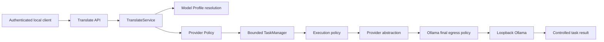

# Current Architecture — M0

单 Spring Boot application，Java 21，独立进程与 Maven artifact。
没有 Maven 子模块、微服务、数据库或 UI。

## 真实 package 边界

| Package | 职责 |
| --- | --- |
| api | DTO 接入、HTTP 状态和安全错误映射、task GET/DELETE |
| capability.translate | 正文预算、版本化翻译规则、应用编排 |
| model | 配置 ModelProfile 和安全 PublicProfile |
| policy | LOCAL/CLOUD 分类校验与无 fallback 策略 |
| provider | Provider、capability、execution、registry、readiness 契约 |
| provider.ollama | 固定本地 HTTP、metadata/model 检查、JSON 校验、响应上限 |
| task | UUID、有限执行/队列/保留容量、取消、deadline、终态提交 |
| security | 自动本地 token、私有文件权限、stateless authentication |
| health | 认证后的 provider/model readiness，与 Actuator 隔离 |
| config | 配置校验、loopback 启动约束 |
| common | 脱敏 ApiError / WorkspaceException |

Provider 错误复用 common 的稳定分类；Ollama 异常 cause / body 不跨适配边界。
TranslateService 依赖 Provider，不依赖 Ollama 类型。Profile 来自 YAML，无数据库。

## 任务生命周期

所有状态提交、查询、取消和 deadline 操作由单进程 monitor 串行化。
Worker 执行不占用 monitor；submit 和 completion 不会把用户正文放入日志。
UUID 在 admission 创建，HTTP 202 后成为任务稳定身份；QUEUE_FULL 不返回未接受的任务。
running/queued 可以转为 CANCELLED 或 TIMED_OUT；只有仍为 RUNNING 的任务可以提交结果。
终态不可逆，已成功结果的后续 DELETE 是 no-op。

队列由 ArrayBlockingQueue 实现，默认 4；ThreadPoolExecutor 默认单 worker。
取消/queue timeout 删除 queued Runnable，及时释放队列容量。
运行取消通过 Cancellation hook 取消 HTTP future，尽力传播。
Worker 结束前不会让新任务获得它的执行槽位，避免与仍在本地执行的代码并发。
Ollama/GPU 的最终停止时间不受 Runtime 保证。

取消/超时的 timer 会从 ScheduledThreadPoolExecutor 删除。
任务记录最多 64；保留容量也参与 admission，满载返回 429，避免无限积累结果。
终态约 2 分钟后过期，查不到返回 TASK_NOT_FOUND；仍在 worker 中的记录保持有界并暂不回收。
无任务清单 API、无任务持久化、无 streaming。

## 出站与安全

Profile `translate.fast` 默认映射 `ollama / qwen3.5:4b / LOCAL / m0-1`。
context 8192、output 2048、temperature 0.1；prompt 版本独立为 `translate-v1`。
Policy 在 admission、worker 执行及最终 Ollama model egress 重验。
M0 任何 PrivacyMode 都拒绝 CLOUD；没有 cloud adapter 或 fallback 路径。

HTTP 访问只到字面量 127.0.0.1，不使用系统 proxy、不跟随 redirect。
tags 用于 provider/model availability；不自动安装模型。
非 streaming chat 必须完整结束、模型身份匹配、assistant 文本非空。
长度截断或 tool_calls 拒绝为 PROVIDER_RESPONSE_INVALID，最多接收 1 MiB。
Provider request deadline 覆盖读取响应正文；connect/request/queue/execution timeout 有独立 phase。

API loopback-only，Bearer token 由专用私有目录持有；CORS 不承担认证职责。
公开 Actuator health 仅包含进程状态。Provider readiness 不影响 Spring readiness。
拒绝 Origin/cross-site capability 请求，未来 pairing 需显式设计客户端 origin/权限规则。
全局只有一个本地客户端信任域，不做 per-client task ownership。

## 其他仓库与长期边界

Workspace 完全不引用、复制或修改 Finance / Local AI Assistant 代码。
没有 Finance DB credential、DB dependency、Tool Gateway 或 `/ai/ask` 改动。
Finance PostgreSQL 长期仍由 Finance 独占；未来仅能通过 authenticated Gateway 访问业务查询服务。
Finance Reality Sync 尚未完成；本机没有验证学校笔记本工作区，不据此进行集成。
Browser 现有路径不变，B11/B12 保持 DEFERRED；本轮不处理扩展迁移。
未建立 Memory、RAG、tool calling、Windows 或其他未来空框架。
