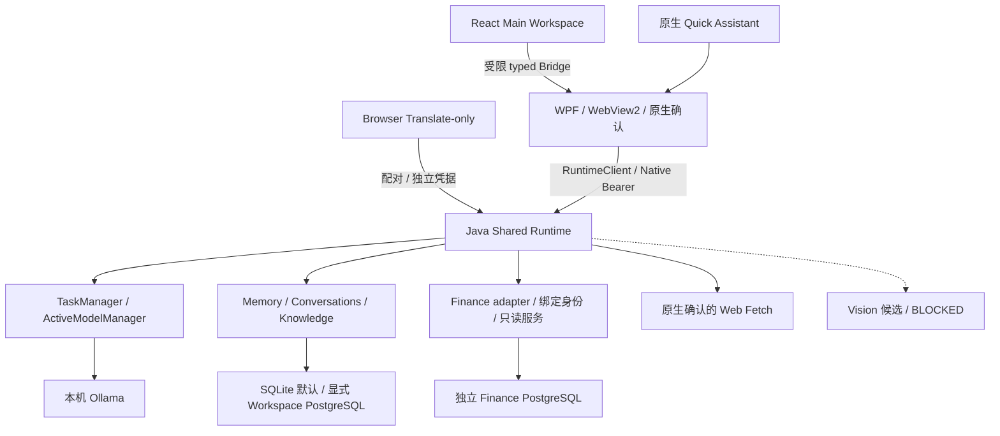

# 当前架构

核对日期：2026-10-28。历史源码核验基线 `12dce0765dcdb89b75fd605c2b4fc7bf5db00617`；当前 main 另包含文档现代化与 Closing 提交，最新主线状态见 [STATUS](../STATUS.md)。本次只同步文档发布状态，模块关系与安全合同未变。

**Development-only；Vision BLOCKED；X1 Windows Acceptance PARTIAL；尚未 Production GO。**

[文档索引](../README.md) · [当前状态](../STATUS.md) · [开发指南](../DEVELOPMENT.md) · [ADR](../ADR/README.md)

## 一个应用 Runtime，明确领域所有权

```mermaid
flowchart TD
    REACT["React Main Workspace"] -->|"受限 typed Bridge"| WPF["WPF / WebView2 / 原生确认"]
    QUICK["原生 Quick Assistant"] --> WPF
    BROWSER["Browser Translate-only"] -->|"配对 / 独立凭据"| RT["Java Shared Runtime"]
    WPF -->|"RuntimeClient / Native Bearer"| RT
    RT --> TASK["TaskManager / ActiveModelManager"]
    TASK --> OLLAMA["本机 Ollama"]
    RT --> WS["Memory / Conversations / Knowledge"]
    WS --> STORAGE["SQLite 默认 / 显式 Workspace PostgreSQL"]
    RT --> FIN["Finance adapter / 绑定身份 / 只读服务"]
    FIN --> FDB["独立 Finance PostgreSQL"]
    RT --> WEB["原生确认的 Web Fetch"]
    RT -.-> VISION["Vision 候选 / BLOCKED"]
```

这不是微服务集群，也不存在第二份 Finance AI Runtime。图中数据连线表示受控调用／持久化关系，不表示所有客户端都有同等权限。Browser 只能执行自己的翻译合同，不能访问 Native-only 个人领域。

## 真实目录与构建关系

| 目录 | 责任 |
| --- | --- |
| [根 POM](../../pom.xml) | Maven reactor：`finance-domain`、`workspace-application` |
| [workspace-application](../../workspace-application/pom.xml) | 应用模块；依赖 finance-domain，编译现有根 `src/main/java`，输出根 `target/` |
| [src/main/java](../../src/main/java/io/github/qianlixunbai/workspace) | Runtime API、任务、模型、Memory、Conversation、Knowledge、Web、持久化、Finance adapter 与安全 |
| [finance-domain](../../finance-domain/README.md) | 从冻结来源迁入的金融查询／DTO／Mapper／SQL；Workspace 独立维护，运行不读取原仓库 |
| [desktop/frontend](../../desktop/frontend/package.json) | 单一 React / TypeScript / Vite package，bundled assets 与界面状态 |
| [desktop/src](../../desktop/src) | WPF 宿主与 Core RuntimeClient；WebView2、原生窗口、快捷键、受控 Copy、Profile / Runtime owner |
| [bootstrap](../../bootstrap) | Native Bootstrap、共享 Windows Profile 安全设施与准入证据 |
| [scripts](../../scripts) | 构建、分发和专项维护／验收入口；历史工具不等于默认启动路径 |

## 展示、原生宿主与服务端

**React** 只持有界面草稿、选择和受限会话状态；不持有 Token、数据库密码、可信文件路径或可自行授信的用户 ID。WebView2 只加载固定可信内容，经 [WorkspaceBridge](../../desktop/src/PersonalAiWorkspace.Desktop/Bridge/WorkspaceBridge.cs) 的白名单方法调用原生宿主。

**WPF** 拥有应用生命周期、托盘、Profile 选择、原生文件选择与确认、选区捕获、复制边界和凭据设置。[RuntimeClient](../../desktop/src/PersonalAiWorkspace.Core/RuntimeClient.cs) 构造受限 loopback 请求；日常开发路径由 [DevelopmentRuntimeOwner](../../desktop/src/PersonalAiWorkspace.Desktop/DevelopmentRuntimeOwner.cs) 管理对应子 Runtime 与显式重启。Ollama 是独立本地服务，不归 React 生命周期管理。

**Runtime** 拥有鉴权／客户端权限、领域校验、revision、任务和模型执行合同。Native Bearer 不授予 Browser 同等权限。浏览器扩展属于独立客户端仓库，本仓库保留其配对／撤销和 Translate-only 服务端边界。

## 任务与模型

[TaskManager](../../src/main/java/io/github/qianlixunbai/workspace/task/TaskManager.java) 统一处理有界并发／排队、状态、取消、超时和结果保留；[ActiveModelManager](../../src/main/java/io/github/qianlixunbai/workspace/model/ActiveModelManager.java) 是唯一 Active owner，管理 capability admission、原生 exact-intent 确认、lease、切换和 uncertainty。

配置选择、安装、加载、Ready、已验证能力是不同事实。默认 profile 中的 `qwen3.5:4b` 不是任意环境的授权；[OllamaModelAdmission](../../src/main/java/io/github/qianlixunbai/workspace/provider/ollama/OllamaModelAdmission.java) 继续核验来源与能力。当前 `MODEL_EXECUTION_UNCERTAIN` 保留，不通过删除状态文件或刷新 UI 自动恢复。

## Workspace 数据领域

| 领域 | 数据真相与边界 |
| --- | --- |
| Memory | 用户主动维护的记录；revision 保护；每次使用显式选取，不自动提取或隐式注入 |
| Conversations | durable 有序轮次与终态；上下文由 Runtime 组装，UI 不重放未确认提交 |
| Knowledge | 独立文档 metadata、源文件／内容与版本；TXT / Markdown 确定性导入，支持独立备份／恢复 |
| 检索 | [KnowledgeLexicalIndex](../../src/main/java/io/github/qianlixunbai/workspace/knowledge/KnowledgeLexicalIndex.java) 的派生词法索引；不是向量数据库 |
| 知识问答 | [KnowledgeAnswerService](../../src/main/java/io/github/qianlixunbai/workspace/capability/knowledge/KnowledgeAnswerService.java) 接收显式问题／检索输入，固定 evidence snapshot，由 Runtime 形成引用；不让模型授信来源 ID |

默认配置为 SQLite，源码另有显式 Workspace PostgreSQL backend。PostgreSQL 使用独立 Workspace schema / Store 实现；不能把 SQLite 的 FTS5 描述套用于全部 backend。Knowledge 源文件仍有独立文件生命周期，不能把一个数据库 dump 当成完整 Knowledge 备份。

## Finance：共享进程，独立数据与身份

`workspace-application → finance-domain` 是真实模块依赖。Runtime 的 [FinanceModuleConfiguration](../../src/main/java/io/github/qianlixunbai/workspace/finance/FinanceModuleConfiguration.java) 显式装配专用 DataSource、MyBatis 与事务边界；默认 Finance / Flyway 均关闭，普通启动不跑 Finance migrations。

Native 首次绑定采用 CREATE_NEW，服务端每次核对 dataset / ACTIVE 用户指纹与 ownership；不信任客户端提交的可信 ID。Finance 账本查询使用独立 PostgreSQL 与只读事务，不混入 Workspace Memory / Knowledge。

现有链包括账户、普通流水／transfer、资产、持仓／Portfolio、投资历史、导入回执、Dashboard / Analytics。Budgets 返回 UNSUPPORTED；账本写入、导入创建／确认和金融工具未装配。原 Finance 仓库按固定来源只读保留，不是 Runtime 必须同时运行的第二个应用。

[FinanceMarketDataQueries](../../src/main/java/io/github/qianlixunbai/workspace/finance/FinanceMarketDataQueries.java) 属于 Workspace 应用层。Massive 仅在用户主动请求时获取获准用途的日线参考，原生保存 Key；不持久缓存、不离线回放、不用于派生估值。历史 Quote / FX 缓存与人工参考估值有独立来源／新鲜度／许可边界，不能与 Massive 即时显示混为一谈。

## Web 与 Vision

**W1A Fetch**：原生逐次确认 → Runtime 独立目标验证 → HTTPS / DNS pinning / SSRF 限制 → 有界抽取与临时结果。它不是自动联网 Agent；Search / Web Answer 尚不作为已交付产品能力。见 [ADR-014](../ADR/ADR-014-controlled-web-access.md) 与 [W1A closing](../milestones/W1A-CLOSING-REPORT.md)。

**Vision**：已有 React / WPF 选图预览、WIC 规范化与 held-handle 候选链、Native-only API、ActiveModelManager 和 Provider 校验。`OllamaVisionEnvironment.REVIEWED_TOKEN_POLICIES` 仍为空，实际 native payload / 环境／token 合同证据未闭合，因此 **BLOCKED**。模型 metadata、磁盘哈希、preview 或无模型 fixture 均不代表 Vision Ready。见 [最新修复报告](../engineering/V1-VISION-GATE-REMEDIATION-REPORT.md)。

## 本地安全、Profile 与备份

开发 Profile 基于 Windows Known Folder 的 `LocalAppData/PersonalAIWorkspace.Development/Profiles/<id>`；OS 句柄绑定实际目录，当前用户／SYSTEM／Administrators 的既有 ACL 合同与 Native Gate 保留。DPAPI CurrentUser 保护指定配置／Key；不授信同 SID 恶意进程，也不把“私有 ACL”称为数据库加密。

| 备份类型 | 范围与限制 |
| --- | --- |
| Memory logical backup | Memory source records；独立格式，新／空目标重建派生数据 |
| Workspace logical backup | Memory + terminal Conversations；不自动包含 Knowledge、Finance 或凭据 |
| Knowledge backup | 独立文档／源文件合同；不能用 Workspace logical backup 代替 |
| PostgreSQL unified offline backup | 独立维护链、revision／文件一致性、OpenPGP 加密流与受控恢复；不在普通 Runtime 启动时执行 |

默认逻辑备份及源数据可能为明文；统一加密备份不改变其他格式。恢复、迁移与真实数据操作必须遵守各自独立门禁，文档更新不改变权限或持久格式。

## 架构决策与历史

[ADR 索引](../ADR/README.md) 区分决定与当前实施；报告中的 GO 仅在其记录范围内有效。旧版 1,178 行架构正文保存在 [历史快照](../history/2026-10-28/architecture.md)，其中“没有 Maven 子模块”“Finance 只能经未来 Gateway 连接”等是早期事实，不适用于本基线。
